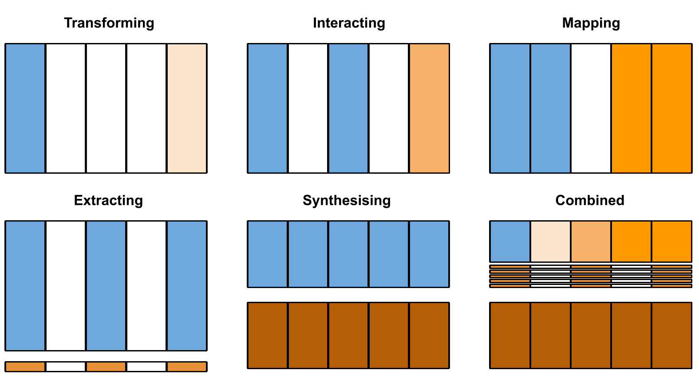

# DeltaPy⁠⁠ — Tabular Data Augmentation & Feature Engineering

[](https://pepy.tech/project/deltapy)

[](https://zenodo.org/badge/latestdoi/253993655)

### Introduction

Tabular augmentation is a new experimental space that makes use of novel and traditional data generation and synthesisation techniques to improve model prediction success. It is in essence a process of modular feature engineering and observation engineering while emphasising the order of augmentation to achieve the best predicted outcome from a given information set. DeltaPy was created with finance applications in mind, but it can be broadly applied to any data-rich environment.

To take full advantage of tabular augmentation for time-series you would perform the techniques in the following order: **(1) transforming**, **(2) interacting**, **(3) mapping**, **(4) extracting**, and **(5) synthesising**. What follows is a practical example of how the above methodology can be used. The purpose here is to establish a framework for table augmentation and to point and guide the user to existing packages.

For most the [Colab Notebook](https://colab.research.google.com/drive/1-uJqGeKZfJegX0TmovhsO90iasyxZYiT) format might be preferred. I have enabled comments if you want to ask question or address any issues you uncover. For anything pressing use the issues tab. Also have a look at the [SSRN report](https://papers.ssrn.com/sol3/papers.cfm?abstract_id=3582219) for a more succinct insights. 



Data augmentation can be defined as any method that could increase the size or improve the quality of a dataset by generating new features or instances without the collection of additional data-points. Data augmentation is of particular importance in image classification tasks where additional data can be created by cropping, padding, or flipping existing images.

Tabular cross-sectional and time-series prediction tasks can also benefit from augmentation. Here we divide tabular augmentation into columnular and row-wise methods. Row-wise methods are further divided into extraction and data synthesisation techniques, whereas columnular methods are divided into transformation, interaction, and mapping methods.  

See the [Skeleton Example](#example), for a combination of multiple methods that lead to a halfing of the mean squared error. 


#### Installation & Citation
----------
```
pip install deltapy
```

```
@software{deltapy,
  title = {{DeltaPy}: Tabular Data Augmentation},
  author = {Snow, Derek},
  url = {https://github.com/firmai/deltapy/},
  version = {0.1.0},
  date = {2020-04-11},
}
```

```
 Snow, Derek, DeltaPy: A Framework for Tabular Data Augmentation in Python (April 22, 2020). Available at SSRN: https://ssrn.com/abstract=3582219
```


### Function Glossary
---------------

**Transformation**
```python
df_out = transform.robust_scaler(df.copy(), drop=["Close_1"]); df_out.head()
df_out = transform.standard_scaler(df.copy(), drop=["Close"]); df_out.head()           
df_out = transform.fast_fracdiff(df.copy(), ["Close","Open"],0.5); df_out.head()
df_out = transform.windsorization(df.copy(),"Close",para,strategy='both'); df_out.head()
df_out = transform.operations(df.copy(),["Close"]); df_out.head()
df_out = transform.triple_exponential_smoothing(df.copy(),["Close"], 12, .2,.2,.2,0); 
df_out = transform.naive_dec(df.copy(), ["Close","Open"]); df_out.head()
df_out = transform.bkb(df.copy(), ["Close"]); df_out.head()
df_out = transform.butter_lowpass_filter(df.copy(),["Close"],4); df_out.head()
df_out = transform.instantaneous_phases(df.copy(), ["Close"]); df_out.head()
df_out = transform.kalman_feat(df.copy(), ["Close"]); df_out.head()
df_out = transform.perd_feat(df.copy(),["Close"]); df_out.head()
df_out = transform.fft_feat(df.copy(), ["Close"]); df_out.head()
df_out = transform.harmonicradar_cw(df.copy(), ["Close"],0.3,0.2); df_out.head()
df_out = transform.saw(df.copy(),["Close","Open"]); df_out.head()
df_out = transform.modify(df.copy(),["Close"]); df_out.head()
df_out = transform.multiple_rolling(df, columns=["Close"]); df_out.head()
df_out = transform.multiple_lags(df, start=1, end=3, columns=["Close"]); df_out.head()
df_out  = transform.prophet_feat(df.copy().reset_index(),["Close","Open"],"Date", "D"); df_out.head()
```
**Interaction**
```python
df_out = interact.lowess(df.copy(), ["Open","Volume"], df["Close"], f=0.25, iter=3); df_out.head()
df_out = interact.autoregression(df.copy()); df_out.head()
df_out = interact.muldiv(df.copy(), ["Close","Open"]); df_out.head()
df_out = interact.decision_tree_disc(df.copy(), ["Close"]); df_out.head()
df_out = interact.quantile_normalize(df.copy(), drop=["Close"]); df_out.head()
df_out = interact.tech(df.copy()); df_out.head()
df_out = interact.genetic_feat(df.copy()); df_out.head()
```
**Mapping**
```python
df_out = mapper.pca_feature(df.copy(),variance_or_components=0.80,drop_cols=["Close_1"]); df_out.head()
df_out = mapper.cross_lag(df.copy()); df_out.head()
df_out = mapper.a_chi(df.copy()); df_out.head()
df_out = mapper.encoder_dataset(df.copy(), ["Close_1"], 15); df_out.head()
df_out = mapper.lle_feat(df.copy(),["Close_1"],4); df_out.head()
df_out = mapper.feature_agg(df.copy(),["Close_1"],4 ); df_out.head()
df_out = mapper.neigh_feat(df.copy(),["Close_1"],4 ); df_out.head()
```

**Extraction**
```python
extract.abs_energy(df["Close"])
extract.cid_ce(df["Close"], True)
extract.mean_abs_change(df["Close"])
extract.mean_second_derivative_central(df["Close"])
extract.variance_larger_than_standard_deviation(df["Close"])
extract.var_index(df["Close"].values,var_index_param)
extract.symmetry_looking(df["Close"])
extract.has_duplicate_max(df["Close"])
extract.partial_autocorrelation(df["Close"])
extract.augmented_dickey_fuller(df["Close"])
extract.gskew(df["Close"])
extract.stetson_mean(df["Close"])
extract.length(df["Close"])
extract.count_above_mean(df["Close"])
extract.longest_strike_below_mean(df["Close"])
extract.wozniak(df["Close"])
extract.last_location_of_maximum(df["Close"])
extract.fft_coefficient(df["Close"])
extract.ar_coefficient(df["Close"])
extract.index_mass_quantile(df["Close"])
extract.number_cwt_peaks(df["Close"])
extract.spkt_welch_density(df["Close"])
extract.linear_trend_timewise(df["Close"])
extract.c3(df["Close"])
extract.binned_entropy(df["Close"])
extract.svd_entropy(df["Close"].values)
extract.hjorth_complexity(df["Close"])
extract.max_langevin_fixed_point(df["Close"])
extract.percent_amplitude(df["Close"])
extract.cad_prob(df["Close"])
extract.zero_crossing_derivative(df["Close"])
extract.detrended_fluctuation_analysis(df["Close"])
extract.fisher_information(df["Close"])
extract.higuchi_fractal_dimension(df["Close"])
extract.petrosian_fractal_dimension(df["Close"])
extract.hurst_exponent(df["Close"])
extract.largest_lyauponov_exponent(df["Close"])
extract.whelch_method(df["Close"])
extract.find_freq(df["Close"])
extract.flux_perc(df["Close"])
extract.range_cum_s(df["Close"])
extract.structure_func(df["Close"])
extract.kurtosis(df["Close"])
extract.stetson_k(df["Close"])
```

Test sets should ideally not be preprocessed with the training data, as in such a way one could be peaking ahead in the training data. The preprocessing parameters should be identified on the test set and then applied on the test set, i.e., the test set should not have an impact on the transformation applied. As an example, you would learn the parameters of PCA decomposition on the training set and then apply the parameters to both the train and the test set. 

The benefit of pipelines become clear when one wants to apply multiple augmentation methods. It makes it easy to learn the parameters and then apply them widely. For the most part, this notebook does not concern itself with 'peaking ahead' or pipelines, for some functions, one might have to restructure to code and make use of open source packages to create your preferred solution.


Documentation by Example
-----------------

**Notebook Dependencies**


```python
pip install deltapy
```


```python
pip install pykalman
pip install tsaug
pip install ta
pip install tsaug
pip install pandasvault
pip install gplearn
pip install ta
pip install seasonal
pip install pandasvault
```

### Data and Package Load


```python
import pandas as pd
import numpy as np
from deltapy import transform, interact, mapper, extract 
import warnings
warnings.filterwarnings('ignore')

def data_copy():
  df = pd.read_csv("https://github.com/firmai/random-assets-two/raw/master/numpy/tsla.csv")
  df["Close_1"] = df["Close"].shift(-1)
  df = df.dropna()
  df["Date"] = pd.to_datetime(df["Date"])
  df = df.set_index("Date")
  return df
df = data_copy(); df.head()
```

Some of these categories are fluid and some techniques could fit into multiple buckets. This is an attempt to find an exhaustive number of techniques, but not an exhaustive list of implementations of the techniques. For example, there are thousands of ways to smooth a time-series, but we have only includes 1-2 techniques of interest under each category.

### **(1) [<font color="black">Transformation:</font>](#transformation)**
-----------------
1. Scaling/Normalisation
2. Standardisation
10. Differencing
3. Capping
13. Operations
4. Smoothing
5. Decomposing
6. Filtering
7. Spectral Analysis
8. Waveforms
9. Modifications
11. Rolling
12. Lagging
14. Forecast Model

### **(2) [<font color="black">Interaction:</font>](#interaction)**
-----------------
1. Regressions
2. Operators
3. Discretising
4. Normalising
5. Distance
6. Speciality
7. Genetic

### **(3) [<font color="black">Mapping:</font>](#mapping)**
-----------------
1. Eigen Decomposition
2. Cross Decomposition
3. Kernel Approximation
4. Autoencoder
5. Manifold Learning
6. Clustering
7. Neighbouring

### **(4) [<font color="black">Extraction:</font>](#extraction)**
-----------------
1. Energy
2. Distance
3. Differencing
4. Derivative
5. Volatility
6. Shape
7. Occurrence
8. Autocorrelation
9. Stochasticity
10. Averages
11. Size
13. Count
14. Streaks
14. Location
15. Model Coefficients
16. Quantile
17. Peaks
18. Density
20. Linearity
20. Non-linearity
21. Entropy
22. Fixed Points
23. Amplitude
23. Probability
24. Crossings
25. Fluctuation
26. Information
27. Fractals
29. Exponent
30. Spectral Analysis
31. Percentile
32. Range
33. Structural
12. Distribution


<a name="transformation"></a>

## **(1) Transformation**

Here transformation is any method that includes only one feature as an input to produce a new feature/s. Transformations can be applied to cross-section and time-series data. Some transformations are exclusive to time-series data (smoothing, filtering), but a handful of functions apply to both. 

Where the time series methods has a centred mean, or are forward-looking, there is a need to recalculate the outputed time series on a running basis to ensure that information of the future does not leak into the model. The last value of this recalculated series or an extracted feature from this series can then be used as a running value that is only backward looking, satisfying the no 'peaking' ahead rule. 

There are some packaged in Python that dynamically create time series and extracts their features, but none that incoropates the dynamic creation of a time series in combination with a wide application of prespecified list of extractions. Because this technique is expensive, we have a preference for models that only take historical data into account. 

In this section we will include a list of all types of transformations, those that only use present information (operations), those that incorporate all values (interpolation methods), those that only include past values (smoothing functions), and those that incorporate a subset window of lagging and leading values (select filters). Only those that use historical values or are turned into prediction methods can be used out of the box. The entire time series can be used in the model development process for historical value methods, and only the forecasted values can be used for prediction models. 

Curve fitting can involve either interpolation, where an exact fit to the data is required, or smoothing, in which a "smooth" function is constructed that approximately fits the data. When using an interpolation method, you are taking future information into account e.g, cubic spline. You can use interpolation methods to forecast into the future (extrapolation), and then use those forecasts in a training set. Or you could recalculate the interpolation for each time step and then extract features out of that series (extraction method). Interpolation and other forward-looking methods can be used if they are turned into prediction problems, then the forecasted values can be trained and tested on, and the fitted data can be diregarded. In the list presented below the first five methods can be used for cross-section and time series data, after that the time-series only methods follow.

#### **(1) Scaling/Normalisation**

There are a multitude of scaling methods available. Scaling generally gets applied to the entire dataset and is especially necessary for certain algorithms. K-means make use of euclidean distance hence the need for scaling. For PCA because we are trying to identify the feature with maximus variance we also need scaling. Similarly, we need scaled features for gradient descent. Any algorithm that is not based on a distance measure is not affected by feature scaling. Some of the methods include range scalers like minimum-maximum scaler, maximum absolute scaler or even standardisation methods like the standard scaler can be used for scaling. The example used here is robust scaler. Normalisation is a good technique when you don't know the distribution of the data. Scaling looks into the future, so parameters have to be training on a training set and applied to a test set.

(i) Robust Scaler

Scaling according to the interquartile range, making it robust to outliers.


```python
def robust_scaler(df, drop=None,quantile_range=(25, 75) ):
    if drop:
      keep = df[drop]
      df = df.drop(drop, axis=1)
    center = np.median(df, axis=0)
    quantiles = np.percentile(df, quantile_range, axis=0)
    scale = quantiles[1] - quantiles[0]
    df = (df - center) / scale
    if drop:
      df = pd.concat((keep,df),axis=1)
    return df

df_out = transform.robust_scaler(df.copy(), drop=["Close_1"]); df_out.head()
```

#### **(2) Standardisation**

When using a standardisation method, it is often more effective when the attribute itself if Gaussian. It is also useful to apply the technique when the model you want to use makes assumptions of Gaussian distributions like linear regression, logistic regression, and linear discriminant analysis. For most applications, standardisation is recommended.

(i) Standard Scaler

Standardize features by removing the mean and scaling to unit variance


```python
def standard_scaler(df,drop ):
    if drop:
      keep = df[drop]
      df = df.drop(drop, axis=1)
    mean = np.mean(df, axis=0)
    scale = np.std(df, axis=0)
    df = (df - mean) / scale  
    if drop:
      df = pd.concat((keep,df),axis=1)
    return df


df_out = transform.standard_scaler(df.copy(), drop=["Close"]); df_out.head()           
```

#### **(3) Differencing**

Computing the differences between consecutive observation, normally used to obtain a stationary time series.

(i) Fractional Differencing

Fractional differencing, allows us to achieve stationarity while maintaining the maximum amount of memory compared to integer differencing.


```python
import pylab as pl

def fast_fracdiff(x, cols, d):
    for col in cols:
      T = len(x[col])
      np2 = int(2 ** np.ceil(np.log2(2 * T - 1)))
      k = np.arange(1, T)
      b = (1,) + tuple(np.cumprod((k - d - 1) / k))
      z = (0,) * (np2 - T)
      z1 = b + z
      z2 = tuple(x[col]) + z
      dx = pl.ifft(pl.fft(z1) * pl.fft(z2))
      x[col+"_frac"] = np.real(dx[0:T])
    return x 
  
df_out = transform.fast_fracdiff(df.copy(), ["Close","Open"],0.5); df_out.head()
```

#### **(4) Capping**

Any method that provides sets a floor and a cap to a feature's value. Capping can affect the distribution of data, so it should not be exagerated. One can cap values by using the average, by using the max and min values, or by an arbitrary extreme value.


(i) Winzorisation

The transformation of features by limiting extreme values in the statistical data to reduce the effect of possibly spurious outliers by replacing it with a certain percentile value.


```python
def outlier_detect(data,col,threshold=1,method="IQR"):
  
    if method == "IQR":
      IQR = data[col].quantile(0.75) - data[col].quantile(0.25)
      Lower_fence = data[col].quantile(0.25) - (IQR * threshold)
      Upper_fence = data[col].quantile(0.75) + (IQR * threshold)
    if method == "STD":
      Upper_fence = data[col].mean() + threshold * data[col].std()
      Lower_fence = data[col].mean() - threshold * data[col].std()   
    if method == "OWN":
      Upper_fence = data[col].mean() + threshold * data[col].std()
      Lower_fence = data[col].mean() - threshold * data[col].std() 
    if method =="MAD":
      median = data[col].median()
      median_absolute_deviation = np.median([np.abs(y - median) for y in data[col]])
      modified_z_scores = pd.Series([0.6745 * (y - median) / median_absolute_deviation for y in data[col]])
      outlier_index = np.abs(modified_z_scores) > threshold
      print('Num of outlier detected:',outlier_index.value_counts()[1])
      print('Proportion of outlier detected',outlier_index.value_counts()[1]/len(outlier_index))
      return outlier_index, (median_absolute_deviation, median_absolute_deviation)

    para = (Upper_fence, Lower_fence)
    tmp = pd.concat([data[col]>Upper_fence,data[col]<Lower_fence],axis=1)
    outlier_index = tmp.any(axis=1)
    print('Num of outlier detected:',outlier_index.value_counts()[1])
    print('Proportion of outlier detected',outlier_index.value_counts()[1]/len(outlier_index))
    
    return outlier_index, para

def windsorization(data,col,para,strategy='both'):
    """
    top-coding & bottom coding (capping the maximum of a distribution at an arbitrarily set value,vice versa)
    """

    data_copy = data.copy(deep=True)  
    if strategy == 'both':
        data_copy.loc[data_copy[col]>para[0],col] = para[0]
        data_copy.loc[data_copy[col]<para[1],col] = para[1]
    elif strategy == 'top':
        data_copy.loc[data_copy[col]>para[0],col] = para[0]
    elif strategy == 'bottom':
        data_copy.loc[data_copy[col]<para[1],col] = para[1]  
    return data_copy

_, para = transform.outlier_detect(df, "Close")
df_out = transform.windsorization(df.copy(),"Close",para,strategy='both'); df_out.head()

```

#### **(5) Operations**


Operations here are treated like traditional transformations. It is the replacement of a variable by a function of that variable. In a stronger sense, a transformation is a replacement that changes the shape of a distribution or relationship.

(i) Power, Log, Recipricol, Square Root


```python
def operations(df,features):
  df_new = df[features]
  df_new = df_new - df_new.min()

  sqr_name = [str(fa)+"_POWER_2" for fa in df_new.columns]
  log_p_name = [str(fa)+"_LOG_p_one_abs" for fa in df_new.columns]
  rec_p_name = [str(fa)+"_RECIP_p_one" for fa in df_new.columns]
  sqrt_name = [str(fa)+"_SQRT_p_one" for fa in df_new.columns]

  df_sqr = pd.DataFrame(np.power(df_new.values, 2),columns=sqr_name, index=df.index)
  df_log = pd.DataFrame(np.log(df_new.add(1).abs().values),columns=log_p_name, index=df.index)
  df_rec = pd.DataFrame(np.reciprocal(df_new.add(1).values),columns=rec_p_name, index=df.index)
  df_sqrt = pd.DataFrame(np.sqrt(df_new.abs().add(1).values),columns=sqrt_name, index=df.index)

  dfs = [df, df_sqr, df_log, df_rec, df_sqrt]

  df=  pd.concat(dfs, axis=1)

  return df

df_out = transform.operations(df.copy(),["Close"]); df_out.head()
```

#### **(6) Smoothing**

Here we maintain that any method that has a component of historical averaging is a smoothing method such as a simple moving average and single, double and tripple exponential smoothing methods. These forms of non-causal filters are also popular in signal processing and are called filters, where exponential smoothing is called an IIR filter and a moving average a FIR filter with equal weighting factors.

(i) Tripple Exponential Smoothing (Holt-Winters Exponential Smoothing)

The Holt-Winters seasonal method comprises the forecast equation and three smoothing equations — one for the level $ℓt$, one for the trend &bt&, and one for the seasonal component $st$. This particular version is performed by looking at the last 12 periods. For that reason, the first 12 records should be disregarded because they can't make use of the required window size for a fair calculation. The calculation is such that values are still provided for those periods based on whatever data might be available. 


```python
def initial_trend(series, slen):
    sum = 0.0
    for i in range(slen):
        sum += float(series[i+slen] - series[i]) / slen
    return sum / slen

def initial_seasonal_components(series, slen):
    seasonals = {}
    season_averages = []
    n_seasons = int(len(series)/slen)
    # compute season averages
    for j in range(n_seasons):
        season_averages.append(sum(series[slen*j:slen*j+slen])/float(slen))
    # compute initial values
    for i in range(slen):
        sum_of_vals_over_avg = 0.0
        for j in range(n_seasons):
            sum_of_vals_over_avg += series[slen*j+i]-season_averages[j]
        seasonals[i] = sum_of_vals_over_avg/n_seasons
    return seasonals

def triple_exponential_smoothing(df,cols, slen, alpha, beta, gamma, n_preds):
    for col in cols:
      result = []
      seasonals = initial_seasonal_components(df[col], slen)
      for i in range(len(df[col])+n_preds):
          if i == 0: # initial values
              smooth = df[col][0]
              trend = initial_trend(df[col], slen)
              result.append(df[col][0])
              continue
          if i >= len(df[col]): # we are forecasting
              m = i - len(df[col]) + 1
              result.append((smooth + m*trend) + seasonals[i%slen])
          else:
              val = df[col][i]
              last_smooth, smooth = smooth, alpha*(val-seasonals[i%slen]) + (1-alpha)*(smooth+trend)
              trend = beta * (smooth-last_smooth) + (1-beta)*trend
              seasonals[i%slen] = gamma*(val-smooth) + (1-gamma)*seasonals[i%slen]
              result.append(smooth+trend+seasonals[i%slen])
      df[col+"_TES"] = result
    #print(seasonals)
    return df

df_out= transform.triple_exponential_smoothing(df.copy(),["Close"], 12, .2,.2,.2,0); df_out.head()
```

#### **(7) Decomposing**

Decomposition procedures are used in time series to describe the trend and seasonal factors in a time series. More extensive decompositions might also include long-run cycles, holiday effects, day of week effects and so on. Here, we’ll only consider trend and seasonal decompositions. A naive decomposition makes use of moving averages, other decomposition methods are available that make use of LOESS.

(i) Naive Decomposition

The base trend takes historical information into account and established moving averages; it does not have to be linear. To estimate the seasonal component for each season, simply average the detrended values for that season. If the seasonal variation looks constant, we should use the additive model. If the magnitude is increasing as a function of time, we will use multiplicative. Here because it is predictive in nature we are using a one sided moving average, as opposed to a two-sided centred average. 


```python
import statsmodels.api as sm

def naive_dec(df, columns, freq=2):
  for col in columns:
    decomposition = sm.tsa.seasonal_decompose(df[col], model='additive', freq = freq, two_sided=False)
    df[col+"_NDDT" ] = decomposition.trend
    df[col+"_NDDT"] = decomposition.seasonal
    df[col+"_NDDT"] = decomposition.resid
  return df

df_out = transform.naive_dec(df.copy(), ["Close","Open"]); df_out.head()
```

#### **(8) Filtering**

It is often useful to either low-pass filter (smooth) time series in order to reveal low-frequency features and trends, or to high-pass filter (detrend) time series in order to isolate high frequency transients (e.g. storms). Low pass filters use historical values, high-pass filters detrends with low-pass filters, so also indirectly uses historical values.

There are a few filters available, closely associated with decompositions and smoothing functions. The Hodrick-Prescott filter separates a time-series $yt$ into a trend $τt$ and a cyclical component $ζt$. The Christiano-Fitzgerald filter is a generalization of Baxter-King filter and can be seen as weighted moving average.

(i) Baxter-King Bandpass

The Baxter-King filter is intended to explicitly deal with the periodicity of the business cycle. By applying their band-pass filter to a series, they produce a new series that does not contain fluctuations at higher or lower than those of the business cycle. The parameters are arbitrarily chosen. This method uses a centred moving average that has to be changed to a lagged moving average before it can be used as an input feature. The maximum period of oscillation should be used as the point to truncate the dataset, as that part of the time series does not incorporate all the required datapoints.


```python
import statsmodels.api as sm

def bkb(df, cols):
  for col in cols:
    df[col+"_BPF"] = sm.tsa.filters.bkfilter(df[[col]].values, 2, 10, len(df)-1)
  return df

df_out = transform.bkb(df.copy(), ["Close"]); df_out.head()
```

(ii) Butter Lowpass (IIR Filter Design)

The Butterworth filter is a type of signal processing filter designed to have a frequency response as flat as possible in the passban. Like other filtersm the first few values have to be disregarded for accurate downstream prediction. Instead of disregarding these values on a per case basis, they can be diregarded in one chunk once the database of transformed features have been developed.


```python
from scipy import signal, integrate
def butter_lowpass(cutoff, fs=20, order=5):
    nyq = 0.5 * fs
    normal_cutoff = cutoff / nyq
    b, a = signal.butter(order, normal_cutoff, btype='low', analog=False)
    return b, a
    
def butter_lowpass_filter(df,cols, cutoff, fs=20, order=5):
    b, a = butter_lowpass(cutoff, fs, order=order)
    for col in cols:
      df[col+"_BUTTER"] = signal.lfilter(b, a, df[col])
    return df

df_out = transform.butter_lowpass_filter(df.copy(),["Close"],4); df_out.head()
```

(iii) Hilbert Transform Angle

The Hilbert transform is a time-domain to time-domain transformation which shifts the phase of a signal by 90 degrees. It is also a centred measure and would be difficult to use in a time series prediction setting, unless it is recalculated on a per step basis or transformed to be based on historical values only.


```python
from scipy import signal
import numpy as np

def instantaneous_phases(df,cols):
    for col in cols:
      df[col+"_HILLB"] = np.unwrap(np.angle(signal.hilbert(df[col], axis=0)), axis=0)
    return df

df_out = transform.instantaneous_phases(df.copy(), ["Close"]); df_out.head()
```

(iiiv) Unscented Kalman Filter


The Kalman filter is better suited for estimating things that change over time. The most tangible example is tracking moving objects. A Kalman filter will be very close to the actual trajectory because it says the most recent measurement is more important than the older ones. The Unscented Kalman Filter (UKF) is a model based-techniques that recursively estimates the states (and with some modifications also parameters) of a nonlinear, dynamic, discrete-time system. The UKF is based on the typical prediction-correction style methods. The Kalman Smoother incorporates future values, the Filter doesn't and can be used for online prediction. The normal Kalman filter is a forward filter in the sense that it makes forecast of the current state using only current and past observations, whereas the smoother is based on computing a suitable linear combination of two filters, which are ran in forward and backward directions. 


```python
from pykalman import UnscentedKalmanFilter

def kalman_feat(df, cols):
  for col in cols:
    ukf = UnscentedKalmanFilter(lambda x, w: x + np.sin(w), lambda x, v: x + v, observation_covariance=0.1)
    (filtered_state_means, filtered_state_covariances) = ukf.filter(df[col])
    (smoothed_state_means, smoothed_state_covariances) = ukf.smooth(df[col])
    df[col+"_UKFSMOOTH"] = smoothed_state_means.flatten()
    df[col+"_UKFFILTER"] = filtered_state_means.flatten()
  return df 

df_out = transform.kalman_feat(df.copy(), ["Close"]); df_out.head()
```

#### **(9) Spectral Analysis**

There are a range of functions for spectral analysis. You can use periodograms and the welch method to estimate the power spectral density. You can also use the welch method to estimate the cross power spectral density. Other techniques include spectograms, Lomb-Scargle periodograms and, short time fourier transform.

(i) Periodogram

This returns an array of sample frequencies and the power spectrum of x, or the power spectral density of x.


```python
from scipy import signal
def perd_feat(df, cols):
  for col in cols:
    sig = signal.periodogram(df[col],fs=1, return_onesided=False)
    df[col+"_FREQ"] = sig[0]
    df[col+"_POWER"] = sig[1]
  return df

df_out = transform.perd_feat(df.copy(),["Close"]); df_out.head()
```

(ii) Fast Fourier Transform

The FFT, or fast fourier transform is an algorithm that essentially uses convolution techniques to efficiently find the magnitude and location of the tones that make up the signal of interest. We can often play with the FFT spectrum, by adding and removing successive tones (which is akin to selectively filtering particular tones that make up the signal), in order to obtain a smoothed version of the underlying signal. This takes the entire signal into account, and as a result has to be recalculated on a running basis to avoid peaking into the future. 


```python
def fft_feat(df, cols):
  for col in cols:
    fft_df = np.fft.fft(np.asarray(df[col].tolist()))
    fft_df = pd.DataFrame({'fft':fft_df})
    df[col+'_FFTABS'] = fft_df['fft'].apply(lambda x: np.abs(x)).values
    df[col+'_FFTANGLE'] = fft_df['fft'].apply(lambda x: np.angle(x)).values
  return df 

df_out = transform.fft_feat(df.copy(), ["Close"]); df_out.head()
```

#### **(10) Waveforms**

The waveform of a signal is the shape of its graph as a function of time.

(i) Continuous Wave Radar


```python
from scipy import signal
def harmonicradar_cw(df, cols, fs,fc):
    for col in cols:
      ttxt = f'CW: {fc} Hz'
      #%% input
      t = df[col]
      tx = np.sin(2*np.pi*fc*t)
      _,Pxx = signal.welch(tx,fs)
      #%% diode
      d = (signal.square(2*np.pi*fc*t))
      d[d<0] = 0.
      #%% output of diode
      rx = tx * d
      df[col+"_HARRAD"] = rx.values
    return df

df_out = transform.harmonicradar_cw(df.copy(), ["Close"],0.3,0.2); df_out.head()
```

(ii) Saw Tooth

Return a periodic sawtooth or triangle waveform.


```python
def saw(df, cols):
  for col in cols:
    df[col+" SAW"] = signal.sawtooth(df[col])
  return df

df_out = transform.saw(df.copy(),["Close","Open"]); df_out.head()
```

##### **(9) Modifications**

A range of modification usually applied ot images, these values would have to be recalculate for each time-series. 

(i) Various Techniques


```python
from tsaug import *
def modify(df, cols):
  for col in cols:
    series = df[col].values
    df[col+"_magnify"], _ = magnify(series, series)
    df[col+"_affine"], _ = affine(series, series)
    df[col+"_crop"], _ = crop(series, series)
    df[col+"_cross_sum"], _ = cross_sum(series, series)
    df[col+"_resample"], _ = resample(series, series)
    df[col+"_trend"], _ = trend(series, series)

    df[col+"_random_affine"], _ = random_time_warp(series, series)
    df[col+"_random_crop"], _ = random_crop(series, series)
    df[col+"_random_cross_sum"], _ = random_cross_sum(series, series)
    df[col+"_random_sidetrack"], _ = random_sidetrack(series, series)
    df[col+"_random_time_warp"], _ = random_time_warp(series, series)
    df[col+"_random_magnify"], _ = random_magnify(series, series)
    df[col+"_random_jitter"], _ = random_jitter(series, series)
    df[col+"_random_trend"], _ = random_trend(series, series)
  return df

df_out = transform.modify(df.copy(),["Close"]); df_out.head()
```

#### **(11) Rolling**

Features that are calculated on a rolling basis over fixed window size.

(i) Mean, Standard Deviation


```python
def multiple_rolling(df, windows = [1,2], functions=["mean","std"], columns=None):
  windows = [1+a for a in windows]
  if not columns:
    columns = df.columns.to_list()
  rolling_dfs = (df[columns].rolling(i)                                    # 1. Create window
                  .agg(functions)                                # 1. Aggregate
                  .rename({col: '{0}_{1:d}'.format(col, i)
                                for col in columns}, axis=1)  # 2. Rename columns
                for i in windows)                                # For each window
  df_out = pd.concat((df, *rolling_dfs), axis=1)
  da = df_out.iloc[:,len(df.columns):]
  da = [col[0] + "_" + col[1] for col in  da.columns.to_list()]
  df_out.columns = df.columns.to_list() + da 

  return  df_out                      # 3. Concatenate dataframes

df_out = transform.multiple_rolling(df, columns=["Close"]); df_out.head()
```

#### **(12) Lagging**

Lagged values from existing features.

(i) Single Steps


```python
def multiple_lags(df, start=1, end=3,columns=None):
  if not columns:
    columns = df.columns.to_list()
  lags = range(start, end+1)  # Just two lags for demonstration.

  df = df.assign(**{
      '{}_t_{}'.format(col, t): df[col].shift(t)
      for t in lags
      for col in columns
  })
  return df

df_out = transform.multiple_lags(df, start=1, end=3, columns=["Close"]); df_out.head()
```

#### **(13) Forecast Model**

There are a range of time series model that can be implemented like AR, MA, ARMA, ARIMA, SARIMA, SARIMAX, VAR, VARMA, VARMAX, SES, and HWES. The models can be divided into autoregressive models and smoothing models. In an autoregression model, we forecast the variable of interest using a linear combination of past values of the variable. Each method might requre specific tuning and parameters to suit your prediction task. You need to drop a certain amount of historical data that you use during the fitting stage. Models that take seasonality into account need more training data.


(i) Prophet

Prophet is a procedure for forecasting time series data based on an additive model where non-linear trends are fit with yearly, weekly, and daily seasonality. You can apply additive models to your training data but also interactive models like deep learning models. The problem is that because these models have learned from future observations, there would this be a need to recalculate the time series on a running basis, or to only include the predicted as opposed to fitted values in future training and test sets. In this example, I train on 150 data points to illustrate how the remaining or so 100 datapoints can be used in a new prediction problem. You can plot with ```df["PROPHET"].plot()``` to see the effect.

You can apply additive models to your training data but also interactive models like deep learning models. The problem is that these models have learned from future observations, there would this be a need to recalculate the time series on a running basis, or to only include the predicted as opposed to fitted values in future training and test sets.


```python
from fbprophet import Prophet

def prophet_feat(df, cols,date, freq,train_size=150):
  def prophet_dataframe(df): 
    df.columns = ['ds','y']
    return df

  def original_dataframe(df, freq, name):
    prophet_pred = pd.DataFrame({"Date" : df['ds'], name : df["yhat"]})
    prophet_pred = prophet_pred.set_index("Date")
    #prophet_pred.index.freq = pd.tseries.frequencies.to_offset(freq)
    return prophet_pred[name].values

  for col in cols:
    model = Prophet(daily_seasonality=True)
    fb = model.fit(prophet_dataframe(df[[date, col]].head(train_size)))
    forecast_len = len(df) - train_size
    future = model.make_future_dataframe(periods=forecast_len,freq=freq)
    future_pred = model.predict(future)
    df[col+"_PROPHET"] = list(original_dataframe(future_pred,freq,col))
  return df

df_out  = transform.prophet_feat(df.copy().reset_index(),["Close","Open"],"Date", "D"); df_out.head()
```

<a name="interaction"></a>

## **(2) Interaction**

Interactions are defined as methods that require more than one feature to create an additional feature. Here we include normalising and discretising techniques that are non-feature specific. Almost all of these method can be applied to cross-section method. The only methods that are time specific is the technical features in the speciality section and the autoregression model.

#### **(1) Regression**

Regression analysis is a set of statistical processes for estimating the relationships between a dependent variable (often called the 'outcome variable') and one or more independent variables. 

(i) Lowess Smoother

The lowess smoother is a robust locally weighted regression. The function fits a nonparametric regression curve to a scatterplot.


```python
from math import ceil
import numpy as np
from scipy import linalg
import math

def lowess(df, cols, y, f=2. / 3., iter=3):
    for col in cols:
      n = len(df[col])
      r = int(ceil(f * n))
      h = [np.sort(np.abs(df[col] - df[col][i]))[r] for i in range(n)]
      w = np.clip(np.abs((df[col][:, None] - df[col][None, :]) / h), 0.0, 1.0)
      w = (1 - w ** 3) ** 3
      yest = np.zeros(n)
      delta = np.ones(n)
      for iteration in range(iter):
          for i in range(n):
              weights = delta * w[:, i]
              b = np.array([np.sum(weights * y), np.sum(weights * y * df[col])])
              A = np.array([[np.sum(weights), np.sum(weights * df[col])],
                            [np.sum(weights * df[col]), np.sum(weights * df[col] * df[col])]])
              beta = linalg.solve(A, b)
              yest[i] = beta[0] + beta[1] * df[col][i]

          residuals = y - yest
          s = np.median(np.abs(residuals))
          delta = np.clip(residuals / (6.0 * s), -1, 1)
          delta = (1 - delta ** 2) ** 2
      df[col+"_LOWESS"] = yest

    return df

df_out = interact.lowess(df.copy(), ["Open","Volume"], df["Close"], f=0.25, iter=3); df_out.head()
```

Autoregression

Autoregression is a time series model that uses observations from previous time steps as input to a regression equation to predict the value at the next time step


```python
from statsmodels.tsa.ar_model import AR
from timeit import default_timer as timer
def autoregression(df, drop=None, settings={"autoreg_lag":4}):

    autoreg_lag = settings["autoreg_lag"]
    if drop:
      keep = df[drop]
      df = df.drop([drop],axis=1).values

    n_channels = df.shape[0]
    t = timer()
    channels_regg = np.zeros((n_channels, autoreg_lag + 1))
    for i in range(0, n_channels):
        fitted_model = AR(df.values[i, :]).fit(autoreg_lag)
        # TODO: This is not the same as Matlab's for some reasons!
        # kk = ARMAResults(fitted_model)
        # autore_vals, dummy1, dummy2 = arburg(x[i, :], autoreg_lag) # This looks like Matlab's but slow
        channels_regg[i, 0: len(fitted_model.params)] = np.real(fitted_model.params)

    for i in range(channels_regg.shape[1]):
      df["LAG_"+str(i+1)] = channels_regg[:,i]
    
    if drop:
      df = pd.concat((keep,df),axis=1)

    t = timer() - t
    return df

df_out = interact.autoregression(df.copy()); df_out.head()
```

####  **(2) Operator**

Looking at interaction between different features. Here the methods employed are multiplication and division.

(i) Multiplication and Division


```python
def muldiv(df, feature_list):
  for feat in feature_list:
    for feat_two in feature_list:
      if feat==feat_two:
        continue
      else:
       df[feat+"/"+feat_two] = df[feat]/(df[feat_two]-df[feat_two].min()) #zero division guard
       df[feat+"_X_"+feat_two] = df[feat]*(df[feat_two])

  return df

df_out = interact.muldiv(df.copy(), ["Close","Open"]); df_out.head()
```

#### **(3) Discretising**

In statistics and machine learning, discretization refers to the process of converting or partitioning continuous attributes, features or variables to discretized or nominal attributes

(i) Decision Tree Discretiser

The first method that will be applies here is a supersived discretiser. Discretisation with Decision Trees consists of using a decision tree to identify the optimal splitting points that would determine the bins or contiguous intervals.


```python
from sklearn.tree import DecisionTreeRegressor

def decision_tree_disc(df, cols, depth=4 ):
  for col in cols:
    df[col +"_m1"] = df[col].shift(1)
    df = df.iloc[1:,:]
    tree_model = DecisionTreeRegressor(max_depth=depth,random_state=0)
    tree_model.fit(df[col +"_m1"].to_frame(), df[col])
    df[col+"_Disc"] = tree_model.predict(df[col +"_m1"].to_frame())
  return df

df_out = interact.decision_tree_disc(df.copy(), ["Close"]); df_out.head()
```

#### **(4) Normalising**

Normalising normally pertains to the scaling of data. There are many method available, interacting normalising methods makes use of all the feature's attributes to do the scaling.

(i) Quantile Normalisation

In statistics, quantile normalization is a technique for making two distributions identical in statistical properties.


```python
import numpy as np
import pandas as pd

def quantile_normalize(df, drop):

    if drop:
      keep = df[drop]
      df = df.drop(drop,axis=1)

    #compute rank
    dic = {}
    for col in df:
      dic.update({col : sorted(df[col])})
    sorted_df = pd.DataFrame(dic)
    rank = sorted_df.mean(axis = 1).tolist()
    #sort
    for col in df:
        t = np.searchsorted(np.sort(df[col]), df[col])
        df[col] = [rank[i] for i in t]
    
    if drop:
      df = pd.concat((keep,df),axis=1)
    return df

df_out = interact.quantile_normalize(df.copy(), drop=["Close"]); df_out.head()
```

#### **(5) Distance**

There are multiple types of distance functions like Euclidean, Mahalanobis, and Minkowski distance. Here we are using a contrived example in a location based haversine distance.

(i) Haversine Distance

The Haversine (or great circle) distance is the angular distance between two points on the surface of a sphere.


```python
from math import sin, cos, sqrt, atan2, radians
def haversine_distance(row, lon="Open", lat="Close"):
    c_lat,c_long = radians(52.5200), radians(13.4050)
    R = 6373.0
    long = radians(row['Open'])
    lat = radians(row['Close'])
    
    dlon = long - c_long
    dlat = lat - c_lat
    a = sin(dlat / 2)**2 + cos(lat) * cos(c_lat) * sin(dlon / 2)**2
    c = 2 * atan2(sqrt(a), sqrt(1 - a))
    
    return R * c

df_out['distance_central'] = df.apply(interact.haversine_distance,axis=1); df_out.head()
```

#### **(6) Speciality**

(i) Technical Features

Technical indicators are heuristic or mathematical calculations based on the price, volume, or open interest of a security or contract used by traders who follow technical analysis. By analyzing historical data, technical analysts use indicators to predict future price movements.


```python
import ta

def tech(df):
  return ta.add_all_ta_features(df, open="Open", high="High", low="Low", close="Close", volume="Volume")
  
df_out = interact.tech(df.copy()); df_out.head()
```

#### **(7) Genetic**

Genetic programming has shown promise in constructing feature by osing original features to form high-level ones that can help algorithms achieve better performance.

(i) Symbolic Transformer


A symbolic transformer is a supervised transformer that begins by building a population of naive random formulas to represent a relationship.


```python
df.head()
```


```python
from gplearn.genetic import SymbolicTransformer

def genetic_feat(df, num_gen=20, num_comp=10):
  function_set = ['add', 'sub', 'mul', 'div',
                  'sqrt', 'log', 'abs', 'neg', 'inv','tan']

  gp = SymbolicTransformer(generations=num_gen, population_size=200,
                          hall_of_fame=100, n_components=num_comp,
                          function_set=function_set,
                          parsimony_coefficient=0.0005,
                          max_samples=0.9, verbose=1,
                          random_state=0, n_jobs=6)

  gen_feats = gp.fit_transform(df.drop("Close_1", axis=1), df["Close_1"]); df.iloc[:,:8]
  gen_feats = pd.DataFrame(gen_feats, columns=["gen_"+str(a) for a in range(gen_feats.shape[1])])
  gen_feats.index = df.index
  return pd.concat((df,gen_feats),axis=1)

df_out = interact.genetic_feat(df.copy()); df_out.head()
```

<a name="mapping"></a>

## **(3) Mapping**

Methods that help with the summarisation of features by remapping them to achieve some aim like the maximisation of variability or class separability. These methods tend to be unsupervised, but can also take an supervised form.

#### **(1) Eigen Decomposition**

Eigendecomposition or sometimes spectral decomposition is the factorization of a matrix into a canonical form, whereby the matrix is represented in terms of its eigenvalues and eigenvectors. Some examples are LDA and PCA.

(i) Principal Component Analysis

Principal component analysis (PCA) is a statistical procedure that uses an orthogonal transformation to convert a set of observations of possibly correlated variables into a set of values of linearly uncorrelated variables called principal components.


```python
def pca_feature(df, memory_issues=False,mem_iss_component=False,variance_or_components=0.80,n_components=5 ,drop_cols=None, non_linear=True):
    
  if non_linear:
    pca = KernelPCA(n_components = n_components, kernel='rbf', fit_inverse_transform=True, random_state = 33, remove_zero_eig= True)
  else:
    if memory_issues:
      if not mem_iss_component:
        raise ValueError("If you have memory issues, you have to preselect mem_iss_component")
      pca = IncrementalPCA(mem_iss_component)
    else:
      if variance_or_components>1:
        pca = PCA(n_components=variance_or_components) 
      else: # automated selection based on variance
        pca = PCA(n_components=variance_or_components,svd_solver="full") 
  if drop_cols:
    X_pca = pca.fit_transform(df.drop(drop_cols,axis=1))
    return pd.concat((df[drop_cols],pd.DataFrame(X_pca, columns=["PCA_"+str(i+1) for i in range(X_pca.shape[1])],index=df.index)),axis=1)

  else:
    X_pca = pca.fit_transform(df)
    return pd.DataFrame(X_pca, columns=["PCA_"+str(i+1) for i in range(X_pca.shape[1])],index=df.index)


  return df

df_out = mapper.pca_feature(df.copy(), variance_or_components=0.9, n_components=8,non_linear=False)
```

#### **(2) Cross Decomposition**

These families of algorithms are useful to find linear relations between two multivariate datasets.

(1) Canonical Correlation Analysis

Canonical-correlation analysis (CCA) is a way of inferring information from cross-covariance matrices.


```python
from sklearn.cross_decomposition import CCA

def cross_lag(df, drop=None, lags=1, components=4 ):

  if drop:
    keep = df[drop]
    df = df.drop([drop],axis=1)

  df_2 = df.shift(lags)
  df = df.iloc[lags:,:]
  df_2 = df_2.dropna().reset_index(drop=True)

  cca = CCA(n_components=components)
  cca.fit(df_2, df)

  X_c, df_2 = cca.transform(df_2, df)
  df_2 = pd.DataFrame(df_2, index=df.index)
  df_2 = df.add_prefix('crd_')

  if drop:
    df = pd.concat([keep,df,df_2],axis=1)
  else:
    df = pd.concat([df,df_2],axis=1)
  return df

df_out = mapper.cross_lag(df.copy()); df_out.head()
```

#### **(3) Kernel Approximation**

Functions that approximate the feature mappings that correspond to certain kernels, as they are used for example in support vector machines.

(i) Additive Chi2 Kernel

Computes the additive chi-squared kernel between observations in X and Y The chi-squared kernel is computed between each pair of rows in X and Y. X and Y have to be non-negative.


```python
from sklearn.kernel_approximation import AdditiveChi2Sampler

def a_chi(df, drop=None, lags=1, sample_steps=2 ):

  if drop:
    keep = df[drop]
    df = df.drop([drop],axis=1)

  df_2 = df.shift(lags)
  df = df.iloc[lags:,:]
  df_2 = df_2.dropna().reset_index(drop=True)

  chi2sampler = AdditiveChi2Sampler(sample_steps=sample_steps)

  df_2 = chi2sampler.fit_transform(df_2, df["Close"])

  df_2 = pd.DataFrame(df_2, index=df.index)
  df_2 = df.add_prefix('achi_')

  if drop:
    df = pd.concat([keep,df,df_2],axis=1)
  else:
    df = pd.concat([df,df_2],axis=1)
  return df

df_out = mapper.a_chi(df.copy()); df_out.head()
```

#### **(4) Autoencoder**

An autoencoder is a type of artificial neural network used to learn efficient data codings in an unsupervised manner. The aim of an autoencoder is to learn a representation (encoding) for a set of data, typically for dimensionality reduction, by training the network to ignore noise.

(i) Feed Forward

The simplest form of an autoencoder is a feedforward, non-recurrent neural network similar to single layer perceptrons that participate in multilayer perceptrons


```python
from sklearn.preprocessing import minmax_scale
import tensorflow as tf
import numpy as np

def encoder_dataset(df, drop=None, dimesions=20):

  if drop:
    train_scaled = minmax_scale(df.drop(drop,axis=1).values, axis = 0)
  else:
    train_scaled = minmax_scale(df.values, axis = 0)

  # define the number of encoding dimensions
  encoding_dim = dimesions
  # define the number of features
  ncol = train_scaled.shape[1]
  input_dim = tf.keras.Input(shape = (ncol, ))

  # Encoder Layers
  encoded1 = tf.keras.layers.Dense(3000, activation = 'relu')(input_dim)
  encoded2 = tf.keras.layers.Dense(2750, activation = 'relu')(encoded1)
  encoded3 = tf.keras.layers.Dense(2500, activation = 'relu')(encoded2)
  encoded4 = tf.keras.layers.Dense(750, activation = 'relu')(encoded3)
  encoded5 = tf.keras.layers.Dense(500, activation = 'relu')(encoded4)
  encoded6 = tf.keras.layers.Dense(250, activation = 'relu')(encoded5)
  encoded7 = tf.keras.layers.Dense(encoding_dim, activation = 'relu')(encoded6)

  encoder = tf.keras.Model(inputs = input_dim, outputs = encoded7)
  encoded_input = tf.keras.Input(shape = (encoding_dim, ))

  encoded_train = pd.DataFrame(encoder.predict(train_scaled),index=df.index)
  encoded_train = encoded_train.add_prefix('encoded_')
  if drop:
    encoded_train = pd.concat((df[drop],encoded_train),axis=1)

  return encoded_train

df_out = mapper.encoder_dataset(df.copy(), ["Close_1"], 15); df_out.head()
```


```python
df_out.head()
```

#### **(5) Manifold Learning**

Manifold Learning can be thought of as an attempt to generalize linear frameworks like PCA to be sensitive to non-linear structure in data. 

(i) Local Linear Embedding

Locally Linear Embedding is a method of non-linear dimensionality reduction. It tries to reduce these n-Dimensions while trying to preserve the geometric features of the original non-linear feature structure.


```python
from sklearn.manifold import LocallyLinearEmbedding

def lle_feat(df, drop=None, components=4):

  if drop:
    keep = df[drop]
    df = df.drop(drop, axis=1)

  embedding = LocallyLinearEmbedding(n_components=components)
  em = embedding.fit_transform(df)
  df = pd.DataFrame(em,index=df.index)
  df = df.add_prefix('lle_')
  if drop:
    df = pd.concat((keep,df),axis=1)
  return df

df_out = mapper.lle_feat(df.copy(),["Close_1"],4); df_out.head()

```

#### **(6) Clustering**

Most clustering techniques start with a bottom up approach: each observation starts in its own cluster, and clusters are successively merged together with some measure. Although these clustering techniques are typically used for observations, it can also be used for feature dimensionality reduction; especially hierarchical clustering techniques. 

(i) Feature Agglomeration

Feature agglomerative uses clustering to group together features that look very similar, thus decreasing the number of features.


```python
import numpy as np
from sklearn import datasets, cluster

def feature_agg(df, drop=None, components=4):

  if drop:
    keep = df[drop]
    df = df.drop(drop, axis=1)

  components = min(df.shape[1]-1,components)
  agglo = cluster.FeatureAgglomeration(n_clusters=components)
  agglo.fit(df)
  df = pd.DataFrame(agglo.transform(df),index=df.index)
  df = df.add_prefix('feagg_')

  if drop:
    return pd.concat((keep,df),axis=1)
  else:
    return df


df_out = mapper.feature_agg(df.copy(),["Close_1"],4 ); df_out.head()
```

#### **(7) Neigbouring**

Neighbouring points can be calculated using distance metrics like Hamming, Manhattan, Minkowski distance. The principle behind nearest neighbor methods is to find a predefined number of training samples closest in distance to the new point, and predict the label from these.

(i) Nearest Neighbours

Unsupervised learner for implementing neighbor searches.


```python
from sklearn.neighbors import NearestNeighbors

def neigh_feat(df, drop, neighbors=6):
  
  if drop:
    keep = df[drop]
    df = df.drop(drop, axis=1)

  components = min(df.shape[0]-1,neighbors)
  neigh = NearestNeighbors(n_neighbors=neighbors)
  neigh.fit(df)
  neigh = neigh.kneighbors()[0]
  df = pd.DataFrame(neigh, index=df.index)
  df = df.add_prefix('neigh_')

  if drop:
    return pd.concat((keep,df),axis=1)
  else:
    return df

  return df

df_out = mapper.neigh_feat(df.copy(),["Close_1"],4 ); df_out.head()

```

<a name="extraction"></a>

## **(4) Extraction**

When working with extraction, you have decide the size of the time series history to take into account when calculating a collection of walk-forward feature values. To facilitate our extraction, we use an excellent package called TSfresh, and also some of their default features. For completeness, we also include 12 or so custom features to be added to the extraction pipeline.

The *time series* methods in the transformation section and the interaction section are similar to the methods we will uncover in the extraction section, however, for transformation and interaction methods the output is an entire new time series, whereas extraction methods takes as input multiple constructed time series and extracts a singular value from each time series to reconstruct an entirely new time series. 

Some methods naturally fit better in one format over another, e.g., lags are too expensive for extraction; time series decomposition only has to be performed once, because it has a low level of 'leakage' so is better suited to transformation; and forecast methods attempt to predict multiple future training samples, so won't work with extraction that only delivers one value per time series. Furthermore all non time-series (cross-sectional) transformation and extraction techniques can not make use of extraction as it is solely a time-series method. 

Lastly, when we want to double apply specific functions we can apply it as a transformation/interaction then all the extraction methods can be applied to this feature as well. For example, if we calculate a smoothing function (transformation) then all other extraction functions (median, entropy, linearity etc.) can now be applied to that smoothing function, including the application of the smoothing function itself, e.g., a double smooth, double lag, double filter etc. So separating these methods out give us great flexibility.

Decorator


```python
def set_property(key, value):
    """
    This method returns a decorator that sets the property key of the function to value
    """
    def decorate_func(func):
        setattr(func, key, value)
        if func.__doc__ and key == "fctype":
            func.__doc__ = func.__doc__ + "\n\n    *This function is of type: " + value + "*\n"
        return func
    return decorate_func
```

#### **(1) Energy**

You can calculate the linear, non-linear and absolute energy of a time series. In signal processing, the energy $E_S$ of a continuous-time signal $x(t)$ is defined as the area under the squared magnitude of the considered signal. Mathematically, $E_{s}=\langle x(t), x(t)\rangle=\int_{-\infty}^{\infty}|x(t)|^{2} d t$

(i) Absolute Energy

Returns the absolute energy of the time series which is the sum over the squared values


```python
#-> In Package
def abs_energy(x):

    if not isinstance(x, (np.ndarray, pd.Series)):
        x = np.asarray(x)
    return np.dot(x, x)

extract.abs_energy(df["Close"])
```

#### **(2) Distance**

Here we widely define distance measures as those that take a difference between attributes or series of datapoints.

(i) Complexity-Invariant Distance

This function calculator is an estimate for a time series complexity.


```python
#-> In Package
def cid_ce(x, normalize):

    if not isinstance(x, (np.ndarray, pd.Series)):
        x = np.asarray(x)
    if normalize:
        s = np.std(x)
        if s!=0:
            x = (x - np.mean(x))/s
        else:
            return 0.0

    x = np.diff(x)
    return np.sqrt(np.dot(x, x))

extract.cid_ce(df["Close"], True)
```

#### **(3) Differencing**

Many alternatives to differencing exists, one can for example take the difference of every other value, take the squared difference, take the fractional difference, or like our example, take the mean absolute difference.

(i) Mean Absolute Change

Returns the mean over the absolute differences between subsequent time series values.


```python
#-> In Package
def mean_abs_change(x):
    return np.mean(np.abs(np.diff(x)))

extract.mean_abs_change(df["Close"])
```

#### **(4) Derivative**

Features where the emphasis is on the rate of change. 

(i) Mean Central Second Derivative

Returns the mean value of a central approximation of the second derivative


```python
#-> In Package
def _roll(a, shift):
    if not isinstance(a, np.ndarray):
        a = np.asarray(a)
    idx = shift % len(a)
    return np.concatenate([a[-idx:], a[:-idx]])

def mean_second_derivative_central(x):

    diff = (_roll(x, 1) - 2 * np.array(x) + _roll(x, -1)) / 2.0
    return np.mean(diff[1:-1])

extract.mean_second_derivative_central(df["Close"])
```

#### **(5) Volatility**

Volatility is a statistical measure of the dispersion of a time-series.

(i) Variance Larger than Standard Deviation


```python
#-> In Package
def variance_larger_than_standard_deviation(x):

    y = np.var(x)
    return y > np.sqrt(y)

extract.variance_larger_than_standard_deviation(df["Close"])
```

(ii) Variability Index

Variability Index is a way to measure how smooth or 'variable' a time series is.


```python
var_index_param = {"Volume":df["Volume"].values, "Open": df["Open"].values}

@set_property("fctype", "combiner")
@set_property("custom", True)
def var_index(time,param=var_index_param):
    final = []
    keys = []
    for key, magnitude in param.items():
      w = 1.0 / np.power(np.subtract(time[1:], time[:-1]), 2)
      w_mean = np.mean(w)

      N = len(time)
      sigma2 = np.var(magnitude)

      S1 = sum(w * (magnitude[1:] - magnitude[:-1]) ** 2)
      S2 = sum(w)

      eta_e = (w_mean * np.power(time[N - 1] -
                time[0], 2) * S1 / (sigma2 * S2 * N ** 2))
      final.append(eta_e)
      keys.append(key)
    return {"Interact__{}".format(k): eta_e for eta_e, k in zip(final,keys) }

extract.var_index(df["Close"].values,var_index_param)
```

#### **(6) Shape**

Features that emphasises a particular shape not ordinarily considered as a distribution statistic. Extends to derivations of the original time series too For example a feature looking at the sinusoidal shape of an autocorrelation plot.

(i) Symmetrical

Boolean variable denoting if the distribution of x looks symmetric.


```python
#-> In Package
def symmetry_looking(x, param=[{"r": 0.2}]):

    if not isinstance(x, (np.ndarray, pd.Series)):
        x = np.asarray(x)
    mean_median_difference = np.abs(np.mean(x) - np.median(x))
    max_min_difference = np.max(x) - np.min(x)
    return [("r_{}".format(r["r"]), mean_median_difference < (r["r"] * max_min_difference))
            for r in param]
            
extract.symmetry_looking(df["Close"])
```

#### **(7) Occurrence**

Looking at the occurrence, and reoccurence of defined values.

(i) Has Duplicate Max


```python
#-> In Package
def has_duplicate_max(x):
    """
    Checks if the maximum value of x is observed more than once

    :param x: the time series to calculate the feature of
    :type x: numpy.ndarray
    :return: the value of this feature
    :return type: bool
    """
    if not isinstance(x, (np.ndarray, pd.Series)):
        x = np.asarray(x)
    return np.sum(x == np.max(x)) >= 2

extract.has_duplicate_max(df["Close"])
```

#### **(8) Autocorrelation**

Autocorrelation, also known as serial correlation, is the correlation of a signal with a delayed copy of itself as a function of delay. 

(i) Partial Autocorrelation

Partial autocorrelation is a summary of the relationship between an observation in a time series with observations at prior time steps with the relationships of intervening observations removed.


```python
#-> In Package
from statsmodels.tsa.stattools import acf, adfuller, pacf

def partial_autocorrelation(x, param=[{"lag": 1}]):

    # Check the difference between demanded lags by param and possible lags to calculate (depends on len(x))
    max_demanded_lag = max([lag["lag"] for lag in param])
    n = len(x)

    # Check if list is too short to make calculations
    if n <= 1:
        pacf_coeffs = [np.nan] * (max_demanded_lag + 1)
    else:
        if (n <= max_demanded_lag):
            max_lag = n - 1
        else:
            max_lag = max_demanded_lag
        pacf_coeffs = list(pacf(x, method="ld", nlags=max_lag))
        pacf_coeffs = pacf_coeffs + [np.nan] * max(0, (max_demanded_lag - max_lag))

    return [("lag_{}".format(lag["lag"]), pacf_coeffs[lag["lag"]]) for lag in param]

extract.partial_autocorrelation(df["Close"])
```

#### **(9) Stochasticity**

Stochastic refers to a randomly determined process. Any features trying to capture stochasticity by degree or type are included under this branch.

(i) Augmented Dickey Fuller

The Augmented Dickey-Fuller test is a hypothesis test which checks whether a unit root is present in a time series sample.


```python
#-> In Package
def augmented_dickey_fuller(x, param=[{"attr": "teststat"}]):

    res = None
    try:
        res = adfuller(x)
    except LinAlgError:
        res = np.NaN, np.NaN, np.NaN
    except ValueError: # occurs if sample size is too small
        res = np.NaN, np.NaN, np.NaN
    except MissingDataError: # is thrown for e.g. inf or nan in the data
        res = np.NaN, np.NaN, np.NaN

    return [('attr_"{}"'.format(config["attr"]),
                  res[0] if config["attr"] == "teststat"
             else res[1] if config["attr"] == "pvalue"
             else res[2] if config["attr"] == "usedlag" else np.NaN)
            for config in param]

extract.augmented_dickey_fuller(df["Close"])
```

#### **(10) Averages**

(i) Median of Magnitudes Skew


```python
@set_property("fctype", "simple")
@set_property("custom", True)
def gskew(x):
    interpolation="nearest"
    median_mag = np.median(x)
    F_3_value = np.percentile(x, 3, interpolation=interpolation)
    F_97_value = np.percentile(x, 97, interpolation=interpolation)

    skew = (np.median(x[x <= F_3_value]) +
            np.median(x[x >= F_97_value]) - 2 * median_mag)

    return skew

extract.gskew(df["Close"])
```

(ii) Stetson Mean

An iteratively weighted mean used in the Stetson variability index


```python
stestson_param = {"weight":100., "alpha":2., "beta":2., "tol":1.e-6, "nmax":20}

@set_property("fctype", "combiner")
@set_property("custom", True)
def stetson_mean(x, param=stestson_param):
    
    weight= stestson_param["weight"]
    alpha= stestson_param["alpha"]
    beta = stestson_param["beta"]
    tol= stestson_param["tol"]
    nmax= stestson_param["nmax"]
    
    
    mu = np.median(x)
    for i in range(nmax):
        resid = x - mu
        resid_err = np.abs(resid) * np.sqrt(weight)
        weight1 = weight / (1. + (resid_err / alpha)**beta)
        weight1 /= weight1.mean()
        diff = np.mean(x * weight1) - mu
        mu += diff
        if (np.abs(diff) < tol*np.abs(mu) or np.abs(diff) < tol):
            break

    return mu

extract.stetson_mean(df["Close"])
```

#### **(11) Size**

(i) Lenght


```python
#-> In Package
def length(x):
    return len(x)
    
extract.length(df["Close"])
```

#### **(12) Count**

(i) Count Above Mean

Returns the number of values in x that are higher than the mean of x


```python
#-> In Package
def count_above_mean(x):
    m = np.mean(x)
    return np.where(x > m)[0].size

extract.count_above_mean(df["Close"])
```

#### **(13) Streaks**

(i) Longest Strike Below Mean

Returns the length of the longest consecutive subsequence in x that is smaller than the mean of x


```python
#-> In Package
import itertools
def get_length_sequences_where(x):

    if len(x) == 0:
        return [0]
    else:
        res = [len(list(group)) for value, group in itertools.groupby(x) if value == 1]
        return res if len(res) > 0 else [0]

def longest_strike_below_mean(x):

    if not isinstance(x, (np.ndarray, pd.Series)):
        x = np.asarray(x)
    return np.max(get_length_sequences_where(x <= np.mean(x))) if x.size > 0 else 0

extract.longest_strike_below_mean(df["Close"])
```

(ii) Wozniak

This is an astronomical feature, we count the number of three consecutive data points that are brighter or fainter than $2σ$ and normalize the number by $N−2$


```python
woz_param = [{"consecutiveStar": n} for n in [2, 4]]

@set_property("fctype", "combiner")
@set_property("custom", True)
def wozniak(magnitude, param=woz_param):

    iters = []
    for consecutiveStar in [stars["consecutiveStar"] for stars in param]:
      N = len(magnitude)
      if N < consecutiveStar:
          return 0
      sigma = np.std(magnitude)
      m = np.mean(magnitude)
      count = 0

      for i in range(N - consecutiveStar + 1):
          flag = 0
          for j in range(consecutiveStar):
              if(magnitude[i + j] > m + 2 * sigma or
                  magnitude[i + j] < m - 2 * sigma):
                  flag = 1
              else:
                  flag = 0
                  break
          if flag:
              count = count + 1
      iters.append(count * 1.0 / (N - consecutiveStar + 1))

    return [("consecutiveStar_{}".format(config["consecutiveStar"]), iters[en] )  for en, config in enumerate(param)]

extract.wozniak(df["Close"])
```

####  **(14) Location**

(i) Last location of Maximum

Returns the relative last location of the maximum value of x.
last_location_of_minimum(x),


```python
#-> In Package
def last_location_of_maximum(x):

    x = np.asarray(x)
    return 1.0 - np.argmax(x[::-1]) / len(x) if len(x) > 0 else np.NaN

extract.last_location_of_maximum(df["Close"])
```

#### **(15) Model Coefficients**

Any coefficient that are obtained from a model that might help in the prediction problem. For example here we might include coefficients of polynomial $h(x)$, which has been fitted to the deterministic dynamics of Langevin model.

(i) FFT Coefficient

Calculates the fourier coefficients of the one-dimensional discrete Fourier Transform for real input.


```python
#-> In Package
def fft_coefficient(x, param = [{"coeff": 10, "attr": "real"}]):

    assert min([config["coeff"] for config in param]) >= 0, "Coefficients must be positive or zero."
    assert set([config["attr"] for config in param]) <= set(["imag", "real", "abs", "angle"]), \
        'Attribute must be "real", "imag", "angle" or "abs"'

    fft = np.fft.rfft(x)

    def complex_agg(x, agg):
        if agg == "real":
            return x.real
        elif agg == "imag":
            return x.imag
        elif agg == "abs":
            return np.abs(x)
        elif agg == "angle":
            return np.angle(x, deg=True)

    res = [complex_agg(fft[config["coeff"]], config["attr"]) if config["coeff"] < len(fft)
           else np.NaN for config in param]
    index = [('coeff_{}__attr_"{}"'.format(config["coeff"], config["attr"]),res[0]) for config in param]
    return index

extract.fft_coefficient(df["Close"])
```

(ii) AR Coefficient

This feature calculator fits the unconditional maximum likelihood of an autoregressive AR(k) process.


```python
#-> In Package
from statsmodels.tsa.ar_model import AR

def ar_coefficient(x, param=[{"coeff": 5, "k": 5}]):

    calculated_ar_params = {}

    x_as_list = list(x)
    calculated_AR = AR(x_as_list)

    res = {}

    for parameter_combination in param:
        k = parameter_combination["k"]
        p = parameter_combination["coeff"]

        column_name = "k_{}__coeff_{}".format(k, p)

        if k not in calculated_ar_params:
            try:
                calculated_ar_params[k] = calculated_AR.fit(maxlag=k, solver="mle").params
            except (LinAlgError, ValueError):
                calculated_ar_params[k] = [np.NaN]*k

        mod = calculated_ar_params[k]

        if p <= k:
            try:
                res[column_name] = mod[p]
            except IndexError:
                res[column_name] = 0
        else:
            res[column_name] = np.NaN

    return [(key, value) for key, value in res.items()]

extract.ar_coefficient(df["Close"])
```

#### **(16) Quantiles**

This includes finding normal quantile values in the series, but also quantile derived measures like change quantiles and index max quantiles. 

(i) Index Mass Quantile

The relative index $i$ where $q\%$ of the mass of the time series $x$ lie left of $i$
.


```python
#-> In Package
def index_mass_quantile(x, param=[{"q": 0.3}]):

    x = np.asarray(x)
    abs_x = np.abs(x)
    s = sum(abs_x)

    if s == 0:
        # all values in x are zero or it has length 0
        return [("q_{}".format(config["q"]), np.NaN) for config in param]
    else:
        # at least one value is not zero
        mass_centralized = np.cumsum(abs_x) / s
        return [("q_{}".format(config["q"]), (np.argmax(mass_centralized >= config["q"])+1)/len(x)) for config in param]

extract.index_mass_quantile(df["Close"])
```

#### **(17) Peaks**

(i) Number of CWT Peaks

This feature calculator searches for different peaks in x.


```python
from scipy.signal import cwt, find_peaks_cwt, ricker, welch

cwt_param = [ka for ka in [2,6,9]]

@set_property("fctype", "combiner")
@set_property("custom", True)
def number_cwt_peaks(x, param=cwt_param):

    return [("CWTPeak_{}".format(n), len(find_peaks_cwt(vector=x, widths=np.array(list(range(1, n + 1))), wavelet=ricker))) for n in param]

extract.number_cwt_peaks(df["Close"])
```

#### **(18) Density**

The density, and more specifically the power spectral density of the signal describes the power present in the signal as a function of frequency, per unit frequency.

(i) Cross Power Spectral Density

This feature calculator estimates the cross power spectral density of the time series $x$ at different frequencies.


```python
#-> In Package
def spkt_welch_density(x, param=[{"coeff": 5}]):
    freq, pxx = welch(x, nperseg=min(len(x), 256))
    coeff = [config["coeff"] for config in param]
    indices = ["coeff_{}".format(i) for i in coeff]

    if len(pxx) <= np.max(coeff):  # There are fewer data points in the time series than requested coefficients

        # filter coefficients that are not contained in pxx
        reduced_coeff = [coefficient for coefficient in coeff if len(pxx) > coefficient]
        not_calculated_coefficients = [coefficient for coefficient in coeff
                                       if coefficient not in reduced_coeff]

        # Fill up the rest of the requested coefficients with np.NaNs
        return zip(indices, list(pxx[reduced_coeff]) + [np.NaN] * len(not_calculated_coefficients))
    else:
        return pxx[coeff].ravel()[0]

extract.spkt_welch_density(df["Close"])
```

#### **(19) Linearity**

Any measure of linearity that might make use of something like the linear least-squares regression for the values of the time series. This can be against the time series minus one and many other alternatives.

(i) Linear Trend Time Wise

Calculate a linear least-squares regression for the values of the time series versus the sequence from 0 to length of the time series minus one.


```python
from scipy.stats import linregress

#-> In Package
def linear_trend_timewise(x, param= [{"attr": "pvalue"}]):

    ix = x.index

    # Get differences between each timestamp and the first timestamp in seconds.
    # Then convert to hours and reshape for linear regression
    times_seconds = (ix - ix[0]).total_seconds()
    times_hours = np.asarray(times_seconds / float(3600))

    linReg = linregress(times_hours, x.values)

    return [("attr_\"{}\"".format(config["attr"]), getattr(linReg, config["attr"]))
            for config in param]

extract.linear_trend_timewise(df["Close"])
```

#### **(20) Non-Linearity**

(i) Schreiber Non-Linearity


```python
#-> In Package
def c3(x, lag=3):
    if not isinstance(x, (np.ndarray, pd.Series)):
        x = np.asarray(x)
    n = x.size
    if 2 * lag >= n:
        return 0
    else:
        return np.mean((_roll(x, 2 * -lag) * _roll(x, -lag) * x)[0:(n - 2 * lag)])

extract.c3(df["Close"])
```

#### **(21) Entropy**

Any feature looking at the complexity of a time series. This is typically used in medical signal disciplines (EEG, EMG). There are multiple types of measures like spectral entropy, permutation entropy, sample entropy, approximate entropy, Lempel-Ziv complexity and other. This includes entropy measures and there derivations.

(i) Binned Entropy

Bins the values of x into max_bins equidistant bins.


```python
#-> In Package
def binned_entropy(x, max_bins=10):
    if not isinstance(x, (np.ndarray, pd.Series)):
        x = np.asarray(x)
    hist, bin_edges = np.histogram(x, bins=max_bins)
    probs = hist / x.size
    return - np.sum(p * np.math.log(p) for p in probs if p != 0)

extract.binned_entropy(df["Close"])
```

(ii) SVD Entropy

SVD entropy is an indicator of the number of eigenvectors that are needed for an adequate explanation of the data set.


```python
svd_param = [{"Tau": ta, "DE": de}
                      for ta in [4] 
                      for de in [3,6]]
                      
def _embed_seq(X,Tau,D):
  N =len(X)
  if D * Tau > N:
      print("Cannot build such a matrix, because D * Tau > N")
      exit()
  if Tau<1:
      print("Tau has to be at least 1")
      exit()
  Y= np.zeros((N - (D - 1) * Tau, D))

  for i in range(0, N - (D - 1) * Tau):
      for j in range(0, D):
          Y[i][j] = X[i + j * Tau]
  return Y                     

@set_property("fctype", "combiner")
@set_property("custom", True)
def svd_entropy(epochs, param=svd_param):
    axis=0
    
    final = []
    for par in param:

      def svd_entropy_1d(X, Tau, DE):
          Y = _embed_seq(X, Tau, DE)
          W = np.linalg.svd(Y, compute_uv=0)
          W /= sum(W)  # normalize singular values
          return -1 * np.sum(W * np.log(W))

      Tau = par["Tau"]
      DE = par["DE"]

      final.append(np.apply_along_axis(svd_entropy_1d, axis, epochs, Tau, DE).ravel()[0])


    return [("Tau_\"{}\"__De_{}\"".format(par["Tau"], par["DE"]), final[en]) for en, par in enumerate(param)]

extract.svd_entropy(df["Close"].values)
```

(iii) Hjort

The Complexity parameter represents the change in frequency. The parameter compares the signal's similarity to a pure sine wave, where the value converges to 1 if the signal is more similar. 


```python
def _hjorth_mobility(epochs):
    diff = np.diff(epochs, axis=0)
    sigma0 = np.std(epochs, axis=0)
    sigma1 = np.std(diff, axis=0)
    return np.divide(sigma1, sigma0)

@set_property("fctype", "simple")
@set_property("custom", True)
def hjorth_complexity(epochs):
    diff1 = np.diff(epochs, axis=0)
    diff2 = np.diff(diff1, axis=0)
    sigma1 = np.std(diff1, axis=0)
    sigma2 = np.std(diff2, axis=0)
    return np.divide(np.divide(sigma2, sigma1), _hjorth_mobility(epochs))

extract.hjorth_complexity(df["Close"])
```

#### **(22) Fixed Points**

Fixed points and equilibria as identified from fitted models.

(i) Langevin Fixed Points

Largest fixed point of dynamics $max\ {h(x)=0}$ estimated from polynomial $h(x)$ which has been fitted to the deterministic dynamics of Langevin model


```python
#-> In Package
def _estimate_friedrich_coefficients(x, m, r):
    assert m > 0, "Order of polynomial need to be positive integer, found {}".format(m)
    df = pd.DataFrame({'signal': x[:-1], 'delta': np.diff(x)})
    try:
        df['quantiles'] = pd.qcut(df.signal, r)
    except ValueError:
        return [np.NaN] * (m + 1)

    quantiles = df.groupby('quantiles')

    result = pd.DataFrame({'x_mean': quantiles.signal.mean(), 'y_mean': quantiles.delta.mean()})
    result.dropna(inplace=True)

    try:
        return np.polyfit(result.x_mean, result.y_mean, deg=m)
    except (np.linalg.LinAlgError, ValueError):
        return [np.NaN] * (m + 1)


def max_langevin_fixed_point(x, r=3, m=30):
    coeff = _estimate_friedrich_coefficients(x, m, r)

    try:
        max_fixed_point = np.max(np.real(np.roots(coeff)))
    except (np.linalg.LinAlgError, ValueError):
        return np.nan

    return max_fixed_point

extract.max_langevin_fixed_point(df["Close"])
```

#### **(23) Amplitude**

Features derived from peaked values in either the positive or negative direction. 

(i) Willison Amplitude

This feature is defined as the amount of times that the change in the signal amplitude exceeds a threshold.


```python
will_param = [ka for ka in [0.2,3]]

@set_property("fctype", "combiner")
@set_property("custom", True)
def willison_amplitude(X, param=will_param):
  return [("Thresh_{}".format(n),np.sum(np.abs(np.diff(X)) >= n)) for n in param]

extract.willison_amplitude(df["Close"])
```

(ii) Percent Amplitude

Returns the largest distance from the median value, measured
    as a percentage of the median


```python
perc_param = [{"base":ba, "exponent":exp} for ba in [3,5] for exp in [-0.1,-0.2]]

@set_property("fctype", "combiner")
@set_property("custom", True)
def percent_amplitude(x, param =perc_param):
    final = []
    for par in param:
      linear_scale_data = par["base"] ** (par["exponent"] * x)
      y_max = np.max(linear_scale_data)
      y_min = np.min(linear_scale_data)
      y_med = np.median(linear_scale_data)
      final.append(max(abs((y_max - y_med) / y_med), abs((y_med - y_min) / y_med)))

    return [("Base_{}__Exp{}".format(pa["base"],pa["exponent"]),fin) for fin, pa in zip(final,param)]

extract.percent_amplitude(df["Close"])
```

#### **(24) Probability**

(i) Cadence Probability

Given the observed distribution of time lags cads, compute the probability that the next observation occurs within time minutes of an arbitrary epoch.


```python
#-> fixes required
import scipy.stats as stats

cad_param = [0.1,1000, -234]

@set_property("fctype", "combiner")
@set_property("custom", True)
def cad_prob(cads, param=cad_param):
    return [("time_{}".format(time), stats.percentileofscore(cads, float(time) / (24.0 * 60.0)) / 100.0) for time in param]
    
extract.cad_prob(df["Close"])
```

#### **(25) Crossings**

Calculates the crossing of the series with other defined values or series.

(i) Zero Crossing Derivative

The positioning of the edge point is located at the zero crossing of the first derivative of the filter.


```python
zero_param = [0.01, 8]

@set_property("fctype", "combiner")
@set_property("custom", True)
def zero_crossing_derivative(epochs, param=zero_param):
    diff = np.diff(epochs)
    norm = diff-diff.mean()
    return [("e_{}".format(e), np.apply_along_axis(lambda epoch: np.sum(((epoch[:-5] <= e) & (epoch[5:] > e))), 0, norm).ravel()[0]) for e in param]

extract.zero_crossing_derivative(df["Close"])
```

#### **(26) Fluctuations**

These features are again from medical signal sciences, but under this category we would include values such as fluctuation based entropy measures, fluctuation of correlation dynamics, and co-fluctuations.

(i) Detrended Fluctuation Analysis (DFA)

DFA Calculate the Hurst exponent using DFA analysis.


```python
from scipy.stats import kurtosis as _kurt
from scipy.stats import skew as _skew
import numpy as np

@set_property("fctype", "simple")
@set_property("custom", True)
def detrended_fluctuation_analysis(epochs):
    def dfa_1d(X, Ave=None, L=None):
        X = np.array(X)

        if Ave is None:
            Ave = np.mean(X)

        Y = np.cumsum(X)
        Y -= Ave

        if L is None:
            L = np.floor(len(X) * 1 / (
                    2 ** np.array(list(range(1, int(np.log2(len(X))) - 4))))
                            )
            
        F = np.zeros(len(L))  # F(n) of different given box length n

        for i in range(0, len(L)):
            n = int(L[i])  # for each box length L[i]
            if n == 0:
                print("time series is too short while the box length is too big")
                print("abort")
                exit()
            for j in range(0, len(X), n):  # for each box
                if j + n < len(X):
                    c = list(range(j, j + n))
                    # coordinates of time in the box
                    c = np.vstack([c, np.ones(n)]).T
                    # the value of data in the box
                    y = Y[j:j + n]
                    # add residue in this box
                    F[i] += np.linalg.lstsq(c, y, rcond=None)[1]
            F[i] /= ((len(X) / n) * n)
        F = np.sqrt(F)

        stacked = np.vstack([np.log(L), np.ones(len(L))])
        stacked_t = stacked.T
        Alpha = np.linalg.lstsq(stacked_t, np.log(F), rcond=None)

        return Alpha[0][0]

    return np.apply_along_axis(dfa_1d, 0, epochs).ravel()[0]

extract.detrended_fluctuation_analysis(df["Close"])
```

#### **(27) Information**

Closely related to entropy and complexity measures. Any measure that attempts to measure the amount of information from an observable variable is included here.

(i) Fisher Information

Fisher information is a statistical information concept distinct from, and earlier than, Shannon information in communication theory.


```python
def _embed_seq(X, Tau, D):

    shape = (X.size - Tau * (D - 1), D)
    strides = (X.itemsize, Tau * X.itemsize)
    return np.lib.stride_tricks.as_strided(X, shape=shape, strides=strides)

fisher_param = [{"Tau":ta, "DE":de} for ta in [3,15] for de in [10,5]]

@set_property("fctype", "combiner")
@set_property("custom", True)
def fisher_information(epochs, param=fisher_param):
    def fisher_info_1d(a, tau, de):
        # taken from pyeeg improvements

        mat = _embed_seq(a, tau, de)
        W = np.linalg.svd(mat, compute_uv=False)
        W /= sum(W)  # normalize singular values
        FI_v = (W[1:] - W[:-1]) ** 2 / W[:-1]
        return np.sum(FI_v)

    return [("Tau_{}__DE_{}".format(par["Tau"], par["DE"]),np.apply_along_axis(fisher_info_1d, 0, epochs, par["Tau"], par["DE"]).ravel()[0]) for par in param]

extract.fisher_information(df["Close"])
```

#### **(28) Fractals**

In mathematics, more specifically in fractal geometry, a fractal dimension is a ratio providing a statistical index of complexity comparing how detail in a pattern (strictly speaking, a fractal pattern) changes with the scale at which it is measured.

(i) Highuchi Fractal

Compute a Higuchi Fractal Dimension of a time series


```python
hig_para = [{"Kmax": 3},{"Kmax": 5}]

@set_property("fctype", "combiner")
@set_property("custom", True)
def higuchi_fractal_dimension(epochs, param=hig_para):
    def hfd_1d(X, Kmax):
        
        L = []
        x = []
        N = len(X)
        for k in range(1, Kmax):
            Lk = []
            for m in range(0, k):
                Lmk = 0
                for i in range(1, int(np.floor((N - m) / k))):
                    Lmk += abs(X[m + i * k] - X[m + i * k - k])
                Lmk = Lmk * (N - 1) / np.floor((N - m) / float(k)) / k
                Lk.append(Lmk)
            L.append(np.log(np.mean(Lk)))
            x.append([np.log(float(1) / k), 1])

        (p, r1, r2, s) = np.linalg.lstsq(x, L, rcond=None)
        return p[0]
    
    return [("Kmax_{}".format(config["Kmax"]), np.apply_along_axis(hfd_1d, 0, epochs, config["Kmax"]).ravel()[0] ) for  config in param]
    
extract.higuchi_fractal_dimension(df["Close"])
```

(ii) Petrosian Fractal

Compute a Petrosian Fractal Dimension of a time series.


```python
@set_property("fctype", "simple")
@set_property("custom", True)
def petrosian_fractal_dimension(epochs):
    def pfd_1d(X, D=None):
        # taken from pyeeg
        """Compute Petrosian Fractal Dimension of a time series from either two
        cases below:
            1. X, the time series of type list (default)
            2. D, the first order differential sequence of X (if D is provided,
               recommended to speed up)
        In case 1, D is computed using Numpy's difference function.
        To speed up, it is recommended to compute D before calling this function
        because D may also be used by other functions whereas computing it here
        again will slow down.
        """
        if D is None:
            D = np.diff(X)
            D = D.tolist()
        N_delta = 0  # number of sign changes in derivative of the signal
        for i in range(1, len(D)):
            if D[i] * D[i - 1] < 0:
                N_delta += 1
        n = len(X)
        return np.log10(n) / (np.log10(n) + np.log10(n / n + 0.4 * N_delta))
    return np.apply_along_axis(pfd_1d, 0, epochs).ravel()[0]

extract.petrosian_fractal_dimension(df["Close"])
```

#### **(29) Exponent**

(i) Hurst Exponent

The Hurst exponent is used as a measure of long-term memory of time series. It relates to the autocorrelations of the time series, and the rate at which these decrease as the lag between pairs of values increases.


```python
@set_property("fctype", "simple")
@set_property("custom", True)
def hurst_exponent(epochs):
    def hurst_1d(X):

        X = np.array(X)
        N = X.size
        T = np.arange(1, N + 1)
        Y = np.cumsum(X)
        Ave_T = Y / T

        S_T = np.zeros(N)
        R_T = np.zeros(N)
        for i in range(N):
            S_T[i] = np.std(X[:i + 1])
            X_T = Y - T * Ave_T[i]
            R_T[i] = np.ptp(X_T[:i + 1])

        for i in range(1, len(S_T)):
            if np.diff(S_T)[i - 1] != 0:
                break
        for j in range(1, len(R_T)):
            if np.diff(R_T)[j - 1] != 0:
                break
        k = max(i, j)
        assert k < 10, "rethink it!"

        R_S = R_T[k:] / S_T[k:]
        R_S = np.log(R_S)

        n = np.log(T)[k:]
        A = np.column_stack((n, np.ones(n.size)))
        [m, c] = np.linalg.lstsq(A, R_S, rcond=None)[0]
        H = m
        return H
    return np.apply_along_axis(hurst_1d, 0, epochs).ravel()[0]

extract.hurst_exponent(df["Close"])
```

(ii) Largest Lyauponov Exponent

In mathematics the Lyapunov exponent or Lyapunov characteristic exponent of a dynamical system is a quantity that characterizes the rate of separation of infinitesimally close trajectories.


```python
def _embed_seq(X, Tau, D):
    shape = (X.size - Tau * (D - 1), D)
    strides = (X.itemsize, Tau * X.itemsize)
    return np.lib.stride_tricks.as_strided(X, shape=shape, strides=strides)

lyaup_param = [{"Tau":4, "n":3, "T":10, "fs":9},{"Tau":8, "n":7, "T":15, "fs":6}]

@set_property("fctype", "combiner")
@set_property("custom", True)
def largest_lyauponov_exponent(epochs, param=lyaup_param):
    def LLE_1d(x, tau, n, T, fs):

        Em = _embed_seq(x, tau, n)
        M = len(Em)
        A = np.tile(Em, (len(Em), 1, 1))
        B = np.transpose(A, [1, 0, 2])
        square_dists = (A - B) ** 2  # square_dists[i,j,k] = (Em[i][k]-Em[j][k])^2
        D = np.sqrt(square_dists[:, :, :].sum(axis=2))  # D[i,j] = ||Em[i]-Em[j]||_2

        # Exclude elements within T of the diagonal
        band = np.tri(D.shape[0], k=T) - np.tri(D.shape[0], k=-T - 1)
        band[band == 1] = np.inf
        neighbors = (D + band).argmin(axis=0)  # nearest neighbors more than T steps away

        # in_bounds[i,j] = (i+j <= M-1 and i+neighbors[j] <= M-1)
        inc = np.tile(np.arange(M), (M, 1))
        row_inds = (np.tile(np.arange(M), (M, 1)).T + inc)
        col_inds = (np.tile(neighbors, (M, 1)) + inc.T)
        in_bounds = np.logical_and(row_inds <= M - 1, col_inds <= M - 1)
        # Uncomment for old (miscounted) version
        # in_bounds = numpy.logical_and(row_inds < M - 1, col_inds < M - 1)
        row_inds[~in_bounds] = 0
        col_inds[~in_bounds] = 0

        # neighbor_dists[i,j] = ||Em[i+j]-Em[i+neighbors[j]]||_2
        neighbor_dists = np.ma.MaskedArray(D[row_inds, col_inds], ~in_bounds)
        J = (~neighbor_dists.mask).sum(axis=1)  # number of in-bounds indices by row
        # Set invalid (zero) values to 1; log(1) = 0 so sum is unchanged

        neighbor_dists[neighbor_dists == 0] = 1

        # !!! this fixes the divide by zero in log error !!!
        neighbor_dists.data[neighbor_dists.data == 0] = 1

        d_ij = np.sum(np.log(neighbor_dists.data), axis=1)
        mean_d = d_ij[J > 0] / J[J > 0]

        x = np.arange(len(mean_d))
        X = np.vstack((x, np.ones(len(mean_d)))).T
        [m, c] = np.linalg.lstsq(X, mean_d, rcond=None)[0]
        Lexp = fs * m
        return Lexp

    return [("Tau_{}__n_{}__T_{}__fs_{}".format(par["Tau"], par["n"], par["T"], par["fs"]), np.apply_along_axis(LLE_1d, 0, epochs, par["Tau"], par["n"], par["T"], par["fs"]).ravel()[0]) for par in param]
  
extract.largest_lyauponov_exponent(df["Close"])
```

#### **(30) Spectral Analysis**

Spectral analysis is analysis in terms of a spectrum of frequencies or related quantities such as energies, eigenvalues, etc.

(i) Whelch Method

The Whelch Method is an approach for spectral density estimation. It is used in physics, engineering, and applied mathematics for estimating the power of a signal at different frequencies.


```python
from scipy import signal, integrate

whelch_param = [100,200]

@set_property("fctype", "combiner")
@set_property("custom", True)
def whelch_method(data, param=whelch_param):

  final = []
  for Fs in param:
    f, pxx = signal.welch(data, fs=Fs, nperseg=1024)
    d = {'psd': pxx, 'freqs': f}
    df = pd.DataFrame(data=d)
    dfs = df.sort_values(['psd'], ascending=False)
    rows = dfs.iloc[:10]
    final.append(rows['freqs'].mean())
  
  return [("Fs_{}".format(pa),fin) for pa, fin in zip(param,final)]

extract.whelch_method(df["Close"])
```


```python
#-> Basically same as above
freq_param = [{"fs":50, "sel":15},{"fs":200, "sel":20}]

@set_property("fctype", "combiner")
@set_property("custom", True)
def find_freq(serie, param=freq_param):

    final = []
    for par in param:
      fft0 = np.fft.rfft(serie*np.hanning(len(serie)))
      freqs = np.fft.rfftfreq(len(serie), d=1.0/par["fs"])
      fftmod = np.array([np.sqrt(fft0[i].real**2 + fft0[i].imag**2) for i in range(0, len(fft0))])
      d = {'fft': fftmod, 'freq': freqs}
      df = pd.DataFrame(d)
      hop = df.sort_values(['fft'], ascending=False)
      rows = hop.iloc[:par["sel"]]
      final.append(rows['freq'].mean())

    return [("Fs_{}__sel{}".format(pa["fs"],pa["sel"]),fin) for pa, fin in zip(param,final)]

extract.find_freq(df["Close"])
```

#### **(31) Percentile**

(i) Flux Percentile

Flux (or radiant flux) is the total amount of energy that crosses a unit area per unit time. Flux is an astronomical value, measured in joules per square metre per second (joules/m2/s), or watts per square metre. Here we provide the ratio of flux percentiles.


```python
#-> In Package

import math
def flux_perc(magnitude):
    sorted_data = np.sort(magnitude)
    lc_length = len(sorted_data)

    F_60_index = int(math.ceil(0.60 * lc_length))
    F_40_index = int(math.ceil(0.40 * lc_length))
    F_5_index = int(math.ceil(0.05 * lc_length))
    F_95_index = int(math.ceil(0.95 * lc_length))

    F_40_60 = sorted_data[F_60_index] - sorted_data[F_40_index]
    F_5_95 = sorted_data[F_95_index] - sorted_data[F_5_index]
    F_mid20 = F_40_60 / F_5_95

    return {"FluxPercentileRatioMid20": F_mid20}

extract.flux_perc(df["Close"])
```

#### **(32) Range**

(i) Range of Cummulative Sum


```python
@set_property("fctype", "simple")
@set_property("custom", True)
def range_cum_s(magnitude):
    sigma = np.std(magnitude)
    N = len(magnitude)
    m = np.mean(magnitude)
    s = np.cumsum(magnitude - m) * 1.0 / (N * sigma)
    R = np.max(s) - np.min(s)
    return {"Rcs": R}

extract.range_cum_s(df["Close"])
```

#### **(33) Structural**

Structural features, potential placeholders for future research.

(i) Structure Function

The structure function of rotation measures (RMs) contains information on electron density and magnetic field fluctuations when used i astronomy. It becomes a custom feature when used with your own unique time series data.


```python
from scipy.interpolate import interp1d

struct_param = {"Volume":df["Volume"].values, "Open": df["Open"].values}

@set_property("fctype", "combiner")
@set_property("custom", True)
def structure_func(time, param=struct_param):

      dict_final = {}
      for key, magnitude in param.items():
        dict_final[key] = []
        Nsf, Np = 100, 100
        sf1, sf2, sf3 = np.zeros(Nsf), np.zeros(Nsf), np.zeros(Nsf)
        f = interp1d(time, magnitude)

        time_int = np.linspace(np.min(time), np.max(time), Np)
        mag_int = f(time_int)

        for tau in np.arange(1, Nsf):
            sf1[tau - 1] = np.mean(
                np.power(np.abs(mag_int[0:Np - tau] - mag_int[tau:Np]), 1.0))
            sf2[tau - 1] = np.mean(
                np.abs(np.power(
                    np.abs(mag_int[0:Np - tau] - mag_int[tau:Np]), 2.0)))
            sf3[tau - 1] = np.mean(
                np.abs(np.power(
                    np.abs(mag_int[0:Np - tau] - mag_int[tau:Np]), 3.0)))
        sf1_log = np.log10(np.trim_zeros(sf1))
        sf2_log = np.log10(np.trim_zeros(sf2))
        sf3_log = np.log10(np.trim_zeros(sf3))

        if len(sf1_log) and len(sf2_log):
            m_21, b_21 = np.polyfit(sf1_log, sf2_log, 1)
        else:

            m_21 = np.nan

        if len(sf1_log) and len(sf3_log):
            m_31, b_31 = np.polyfit(sf1_log, sf3_log, 1)
        else:

            m_31 = np.nan

        if len(sf2_log) and len(sf3_log):
            m_32, b_32 = np.polyfit(sf2_log, sf3_log, 1)
        else:

            m_32 = np.nan
        dict_final[key].append(m_21)
        dict_final[key].append(m_31)
        dict_final[key].append(m_32)

      return [("StructureFunction_{}__m_{}".format(key, name), li)  for key, lis in dict_final.items() for name, li in zip([21,31,32], lis)]

struct_param = {"Volume":df["Volume"].values, "Open": df["Open"].values}

extract.structure_func(df["Close"],struct_param)
```

#### **(34) Distribution**

(i) Kurtosis


```python
#-> In Package
def kurtosis(x):

    if not isinstance(x, pd.Series):
        x = pd.Series(x)
    return pd.Series.kurtosis(x)

extract.kurtosis(df["Close"])
```

(ii) Stetson Kurtosis


```python
@set_property("fctype", "simple")
@set_property("custom", True)
def stetson_k(x):
    """A robust kurtosis statistic."""
    n = len(x)
    x0 = stetson_mean(x, 1./20**2)
    delta_x = np.sqrt(n / (n - 1.)) * (x - x0) / 20
    ta = 1. / 0.798 * np.mean(np.abs(delta_x)) / np.sqrt(np.mean(delta_x**2))
    return ta
  
extract.stetson_k(df["Close"])
```

## **(5) Synthesise**

Time-Series synthesisation (TSS) happens before the feature extraction step and Cross Sectional Synthesisation (CSS) happens after the feature extraction step. Currently I will only include a CSS package, in the future, I would further work on developing out this section. This area still has a lot of performance and stability issues. In the future it might be a more viable candidate to improve prediction.


```python
from lightgbm import LGBMRegressor
from sklearn.metrics import mean_squared_error

def model(df_final):
  model = LGBMRegressor()
  test =  df_final.head(int(len(df_final)*0.4))
  train = df_final[~df_final.isin(test)].dropna()
  model = model.fit(train.drop(["Close_1"],axis=1),train["Close_1"])
  preds = model.predict(test.drop(["Close_1"],axis=1))
  test =  df_final.head(int(len(df_final)*0.4))
  train = df_final[~df_final.isin(test)].dropna()
  model = model.fit(train.drop(["Close_1"],axis=1),train["Close_1"])
  val = mean_squared_error(test["Close_1"],preds); 
  return val
```


```python
pip install ctgan
```


```python
from ctgan import CTGANSynthesizer

#discrete_columns = [""]
ctgan = CTGANSynthesizer()
ctgan.fit(df,epochs=10) #15
```

Random Benchmark


```python
np.random.seed(1)
df_in = df.copy()
df_in["Close_1"] = np.random.permutation(df_in["Close_1"].values)
model(df_in)
```

Generated Performance


```python
df_gen = ctgan.sample(len(df_in)*100)
model(df_gen)
```

As expected a cross-sectional technique, does not work well on time-series data, in the future, other methods will be investigated.

<a name="example"></a>

## **(6) Skeleton Example**

Here I will perform tabular agumenting methods on a small dataset single digit features and around 250 instances. This is not necessarily the best sized dataset to highlight the performance of tabular augmentation as some method like extraction would be overkill as it would lead to dimensionality problems. It is also good to know that there are close to infinite number of ways to perform these augmentation methods. In the future, automated augmentation methods can guide the experiment process. 

The approach taken in this skeleton is to develop running models that are tested after each augmentation to highlight what methods might work well on this particular dataset. The metric we will use is mean squared error. In this implementation we do not have special hold-out sets.

The above framework of implementation will be consulted, but one still have to be strategic as to when you apply what function, and you have to make sure that you are processing your data with appropriate techniques (drop null values, fill null values) at the appropriate time.

#### **Validation**

Develop Model and Define Metric


```python
from lightgbm import LGBMRegressor
from sklearn.metrics import mean_squared_error

def model(df_final):
  model = LGBMRegressor()
  test =  df_final.head(int(len(df_final)*0.4))
  train = df_final[~df_final.isin(test)].dropna()
  model = model.fit(train.drop(["Close_1"],axis=1),train["Close_1"])
  preds = model.predict(test.drop(["Close_1"],axis=1))
  test =  df_final.head(int(len(df_final)*0.4))
  train = df_final[~df_final.isin(test)].dropna()
  model = model.fit(train.drop(["Close_1"],axis=1),train["Close_1"])
  val = mean_squared_error(test["Close_1"],preds); 
  return val
```

Reload Data


```python
df = data_copy()
```


```python
model(df)
```

    302.61676570345287


**(1) (7) (i) Transformation - Decomposition - Naive**


```python
## If Inferred Seasonality is Too Large Default to Five
seasons = transform.infer_seasonality(df["Close"],index=0) 
df_out = transform.naive_dec(df.copy(), ["Close","Open"], freq=5)
model(df_out) #improvement
```


    274.34477082783525


**(1) (8) (i) Transformation - Filter - Baxter-King-Bandpass**


```python
df_out = transform.bkb(df_out, ["Close","Low"])
df_best = df_out.copy()
model(df_out) #improvement
```


    267.1826850968307


**(1) (3) (i) Transformation - Differentiation - Fractional**


```python
df_out = transform.fast_fracdiff(df_out, ["Close_BPF"],0.5)
model(df_out) #null
```


    267.7083192402742


**(1) (1) (i) Transformation - Scaling - Robust Scaler**


```python
df_out = df_out.dropna()
df_out = transform.robust_scaler(df_out, drop=["Close_1"])
model(df_out) #noisy
```


    270.96980399571214


**(2) (2) (i) Interactions - Operator - Multiplication/Division**


```python
df_out.head()
```


<table class="dataframe">
  <thead>
    <tr style="text-align: right;">
      <th></th>
      <th>Close_1</th>
      <th>High</th>
      <th>Low</th>
      <th>Open</th>
      <th>Close</th>
      <th>Volume</th>
      <th>Adj Close</th>
      <th>Close_NDDT</th>
      <th>Close_NDDS</th>
      <th>Close_NDDR</th>
      <th>Open_NDDT</th>
      <th>Open_NDDS</th>
      <th>Open_NDDR</th>
      <th>Close_BPF</th>
      <th>Low_BPF</th>
      <th>Close_BPF_frac</th>
    </tr>
    <tr>
      <th>Date</th>
      <th></th>
      <th></th>
      <th></th>
      <th></th>
      <th></th>
      <th></th>
      <th></th>
      <th></th>
      <th></th>
      <th></th>
      <th></th>
      <th></th>
      <th></th>
      <th></th>
      <th></th>
      <th></th>
    </tr>
  </thead>
  <tbody>
    <tr>
      <th>2019-01-08</th>
      <td>338.529999</td>
      <td>1.018413</td>
      <td>0.964048</td>
      <td>1.096600</td>
      <td>1.001175</td>
      <td>-0.162616</td>
      <td>1.001175</td>
      <td>0.832297</td>
      <td>0.834964</td>
      <td>1.335433</td>
      <td>0.758743</td>
      <td>0.691596</td>
      <td>2.259884</td>
      <td>-2.534142</td>
      <td>-2.249135</td>
      <td>-3.593612</td>
    </tr>
    <tr>
      <th>2019-01-09</th>
      <td>344.970001</td>
      <td>1.012068</td>
      <td>1.023302</td>
      <td>1.011466</td>
      <td>1.042689</td>
      <td>-0.501798</td>
      <td>1.042689</td>
      <td>0.908963</td>
      <td>-0.165036</td>
      <td>1.111346</td>
      <td>0.835786</td>
      <td>0.333361</td>
      <td>1.129783</td>
      <td>-3.081959</td>
      <td>-2.776302</td>
      <td>-2.523465</td>
    </tr>
    <tr>
      <th>2019-01-10</th>
      <td>347.260010</td>
      <td>1.035581</td>
      <td>1.027563</td>
      <td>0.996969</td>
      <td>1.126762</td>
      <td>-0.367576</td>
      <td>1.126762</td>
      <td>1.029347</td>
      <td>2.120026</td>
      <td>0.853697</td>
      <td>0.907588</td>
      <td>0.000000</td>
      <td>0.533777</td>
      <td>-2.052768</td>
      <td>-2.543449</td>
      <td>-0.747382</td>
    </tr>
    <tr>
      <th>2019-01-11</th>
      <td>334.399994</td>
      <td>1.073153</td>
      <td>1.120506</td>
      <td>1.098313</td>
      <td>1.156658</td>
      <td>-0.586571</td>
      <td>1.156658</td>
      <td>1.109144</td>
      <td>-5.156051</td>
      <td>0.591990</td>
      <td>1.002162</td>
      <td>-0.666639</td>
      <td>0.608516</td>
      <td>-0.694642</td>
      <td>-0.831670</td>
      <td>0.414063</td>
    </tr>
    <tr>
      <th>2019-01-14</th>
      <td>344.429993</td>
      <td>0.999627</td>
      <td>1.056991</td>
      <td>1.102135</td>
      <td>0.988773</td>
      <td>-0.541752</td>
      <td>0.988773</td>
      <td>1.107633</td>
      <td>0.000000</td>
      <td>-0.660350</td>
      <td>1.056302</td>
      <td>-0.915491</td>
      <td>0.263025</td>
      <td>-0.645590</td>
      <td>-0.116166</td>
      <td>-0.118012</td>
    </tr>
  </tbody>
</table>


```python
df_out = interact.muldiv(df_out, ["Close","Open_NDDS","Low_BPF"]) 
model(df_out) #noisy
```


    285.6420643864313


```python
df_r = df_out.copy()
```

**(2) (6) (i) Interactions - Speciality - Technical**


```python
import ta
df = interact.tech(df)
df_out = pd.merge(df_out,  df.iloc[:,7:], left_index=True, right_index=True, how="left")
```

**Clean Dataframe and Metric**


```python
"""Droping column where missing values are above a threshold"""
df_out = df_out.dropna(thresh = len(df_out)*0.95, axis = "columns") 
df_out = df_out.dropna()
df_out = df_out.replace([np.inf, -np.inf], np.nan).ffill().fillna(0)
close = df_out["Close"].copy()
df_d = df_out.copy()
model(df_out) #improve
```


    592.52971755184


**(3) (1) (i) Mapping - Eigen Decomposition - PCA**


```python
from sklearn.decomposition import PCA, IncrementalPCA, KernelPCA

df_out = transform.robust_scaler(df_out, drop=["Close_1"])
```


```python
df_out = df_out.replace([np.inf, -np.inf], np.nan).ffill().fillna(0)
df_out = mapper.pca_feature(df_out, drop_cols=["Close_1"], variance_or_components=0.9, n_components=8,non_linear=False)
```


```python
model(df_out) #noisy but not too bad given the 10 fold dimensionality reduction
```


    687.158330455884


**(4) Extracting**

Here at first, I show the functions that have been added to the DeltaPy fork of tsfresh. You have to add your own personal adjustments based on the features you would like to construct. I am using self-developed features, but you can also use TSFresh's community functions.

*The following files have been appropriately ammended (Get in contact for advice)*
1. https://github.com/firmai/tsfresh/blob/master/tsfresh/feature_extraction/settings.py
1. https://github.com/firmai/tsfresh/blob/master/tsfresh/feature_extraction/feature_calculators.py
1. https://github.com/firmai/tsfresh/blob/master/tsfresh/feature_extraction/extraction.py

**(4) (10) (i) Extracting - Averages - GSkew**


```python
extract.gskew(df_out["PCA_1"])
```


    -0.7903067336449059


**(4) (21) (ii) Extracting - Entropy - SVD Entropy**


```python
svd_param = [{"Tau": ta, "DE": de}
                      for ta in [4] 
                      for de in [3,6]]

extract.svd_entropy(df_out["PCA_1"],svd_param)
```


    [('Tau_"4"__De_3"', 0.7234823323374294),
     ('Tau_"4"__De_6"', 1.3014347840145244)]


**(4) (13) (ii) Extracting - Streaks - Wozniak**


```python
woz_param = [{"consecutiveStar": n} for n in [2, 4]]

extract.wozniak(df_out["PCA_1"],woz_param)
```


    [('consecutiveStar_2', 0.012658227848101266), ('consecutiveStar_4', 0.0)]


**(4) (28) (i) Extracting - Fractal - Higuchi**


```python
hig_param = [{"Kmax": 3},{"Kmax": 5}]

extract.higuchi_fractal_dimension(df_out["PCA_1"],hig_param)
```


    [('Kmax_3', 0.577913816027104), ('Kmax_5', 0.8176960510304725)]


**(4) (5) (ii) Extracting - Volatility - Variability Index**


```python
var_index_param = {"Volume":df["Volume"].values, "Open": df["Open"].values}

extract.var_index(df["Close"].values,var_index_param)
```


    {'Interact__Open': 0.00396022538846289,
     'Interact__Volume': 0.20550155114176533}


**Time Series Extraction**


```python
pip install git+git://github.com/firmai/tsfresh.git
```

```python
#Construct the preferred input dataframe.
from tsfresh.utilities.dataframe_functions import roll_time_series
df_out["ID"] = 0
periods = 30
df_out = df_out.reset_index()
df_ts = roll_time_series(df_out,"ID","Date",None,1,periods)
counts = df_ts['ID'].value_counts()
df_ts = df_ts[df_ts['ID'].isin(counts[counts > periods].index)]
```


```python
#Perform extraction
from tsfresh.feature_extraction import extract_features, CustomFCParameters
settings_dict = CustomFCParameters()
settings_dict["var_index"] = {"PCA_1":None, "PCA_2": None}
df_feat = extract_features(df_ts.drop(["Close_1"],axis=1),default_fc_parameters=settings_dict,column_id="ID",column_sort="Date")
```

    Feature Extraction: 100%|██████████| 5/5 [00:10<00:00,  2.14s/it]


```python
# Cleaning operations
import pandasvault as pv
df_feat2 = df_feat.copy()
df_feat = df_feat.dropna(thresh = len(df_feat)*0.50, axis = "columns")
df_feat_cons = pv.constant_feature_detect(data=df_feat,threshold=0.9)
df_feat = df_feat.drop(df_feat_cons, axis=1)
df_feat = df_feat.ffill()
df_feat = pd.merge(df_feat,df[["Close_1"]],left_index=True,right_index=True,how="left")
print(df_feat.shape)
model(df_feat) #noisy
```

    7  variables are found to be almost constant
    (208, 48)
    2064.7813982935995


```python
from tsfresh import select_features
from tsfresh.utilities.dataframe_functions import impute

impute(df_feat)
df_feat_2 = select_features(df_feat.drop(["Close_1"],axis=1),df_feat["Close_1"],fdr_level=0.05)
df_feat_2["Close_1"] = df_feat["Close_1"]
model(df_feat_2) #improvement (b/ not an augmentation method)
```


    1577.5273071299482


**(3) (6) (i) Feature Agglomoration; &nbsp; (1)(2)(i) Standard Scaler.**

Like in this step, after (1), (2), (3), (4) and (5), you can often circle back to the initial steps to normalise the data and dimensionally reduce the data for the final model. 


```python
import numpy as np
from sklearn import datasets, cluster

def feature_agg(df, drop, components):
  components = min(df.shape[1]-1,components)
  agglo = cluster.FeatureAgglomeration(n_clusters=components,)
  df = df.drop(drop,axis=1)
  agglo.fit(df)
  df = pd.DataFrame(agglo.transform(df))
  df = df.add_prefix('fe_agg_')

  return df

df_final = transform.standard_scaler(df_feat_2, drop=["Close_1"])
df_final = mapper.feature_agg(df_final,["Close_1"],4)
df_final.index = df_feat.index
df_final["Close_1"] = df_feat["Close_1"]
model(df_final) #noisy
```


    1949.89085894338


**Final Model** After Applying 13 Arbitrary Augmentation Techniques


```python
model(df_final) #improvement
```


    1949.89085894338


**Original Model** Before Augmentation


```python
df_org = df.iloc[:,:7][df.index.isin(df_final.index)]
model(df_org)
```


    389.783990984133


**Best Model** After Developing 8 Augmenting Features


```python
df_best = df_best.replace([np.inf, -np.inf], np.nan).ffill().fillna(0)
model(df_best)
```


    267.1826850968307


**Commentary**

There are countless ways in which the current model can be improved, this can take on an automated process where all techniques are tested against a hold out set, for example, we can perform the operation below, and even though it improves the score here, there is a need for more robust tests. The skeleton example above is not meant to highlight the performance of the package. It simply serves as an example of how one can go about applying augmentation methods. 

Quite naturally this example suffers from dimensionality issues with array shapes reaching ```(208, 48)```, furthermore you would need a sample that is at least 50-100 times larger before machine learning methods start to make sense.

Nonetheless, in this example, *Transformation, Interactions* and *Mappings* (applied to extraction output) performed fairly well. *Extraction* augmentation was overkill, but created a reasonable model when dimensionally reduced. A better selection of one of the 50+ augmentation methods and the order of augmentation could further help improve the outcome if robustly tested against development sets.


[[1]](https://colab.research.google.com/drive/1tstO4fja9wRWjkPgjxRYr9MEvYXTx7fA) DeltaPy Development 
